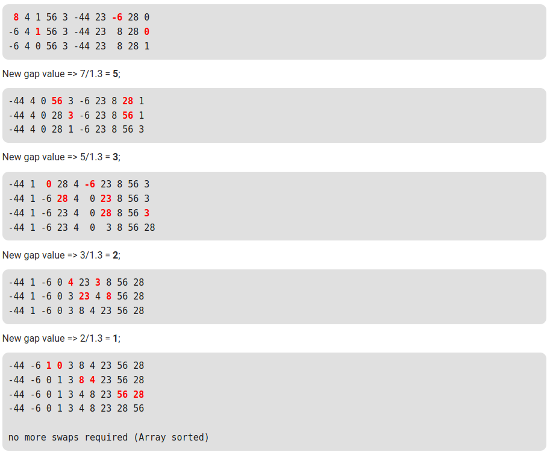

# Comb Sort

@see https://www.geeksforgeeks.org/comb-sort/<br/>
@see https://en.wikipedia.org/wiki/Comb_sort

>Comb Sort is mainly an improvement over Bubble Sort. Bubble sort always compares adjacent values. So all inversions are removed one by one. Comb Sort improves on Bubble Sort by using gap of size more than 1. The gap starts with a large value and shrinks by a factor of 1.3 in every iteration until it reaches the value 1. Thus Comb Sort removes more than one inversion counts with one swap and performs better than Bubble Sort.

_**The shrink factor has been empirically found to be 1.3 (by testing Combsort on over 200,000 random lists) [Source: Wiki]**_

Although, it works better than Bubble Sort on average, worst case remains O(n2).

Illustration:
Let the array elements be



```
8, 4, 1, 56, 3, -44, 23, -6, 28, 0
```

Initially gap value = 10
After shrinking gap value => 10/1.3 = **7**;

```
 8 4 1 56 3 -44 23 -6 28 0
-6 4 1 56 3 -44 23  8 28 0
-6 4 0 56 3 -44 23  8 28 1
```

New gap value => 7/1.3 = 5;

```
-44 4 0 56 3 -6 23 8 28 1
-44 4 0 28 3 -6 23 8 56 1
-44 4 0 28 1 -6 23 8 56 3
```

New gap value => 5/1.3 = 3;

```
-44 1  0 28 4 -6 23 8 56 3
-44 1 -6 28 4  0 23 8 56 3
-44 1 -6 23 4  0 28 8 56 3
-44 1 -6 23 4  0  3 8 56 28
```

New gap value => 3/1.3 = 2;

```
-44 1 -6 0 4 23 3 8 56 28
-44 1 -6 0 3 23 4 8 56 28
-44 1 -6 0 3 8 4 23 56 28
```

New gap value => 2/1.3 = 1;

```
-44 -6 1 0 3 8 4 23 56 28
-44 -6 0 1 3 8 4 23 56 28
-44 -6 0 1 3 4 8 23 56 28
-44 -6 0 1 3 4 8 23 28 56 
```

no more swaps required (Array sorted)

>Time Complexity : Worst case complexity of this algorithm is O(n2) and the Best Case complexity is O(n).

Auxiliary Space : O(1).