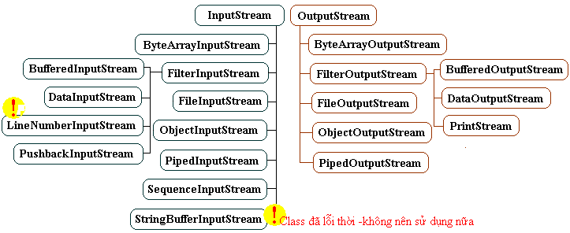
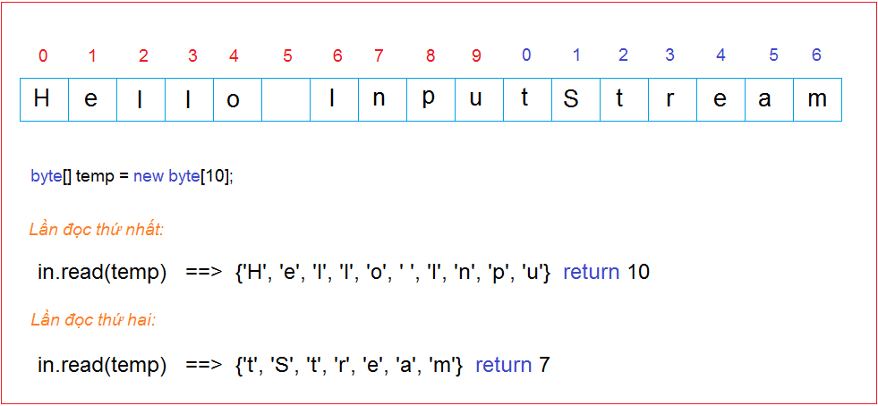
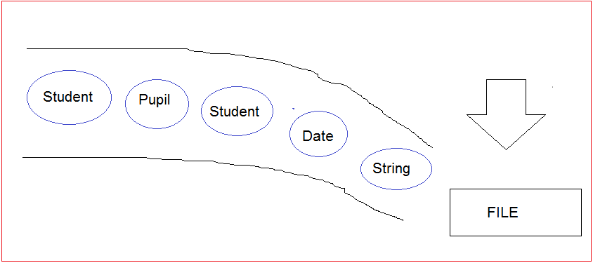
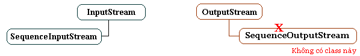
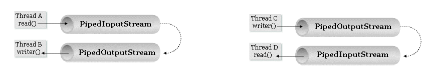
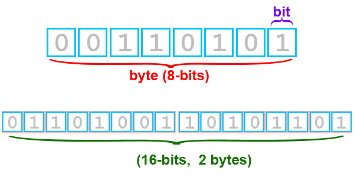
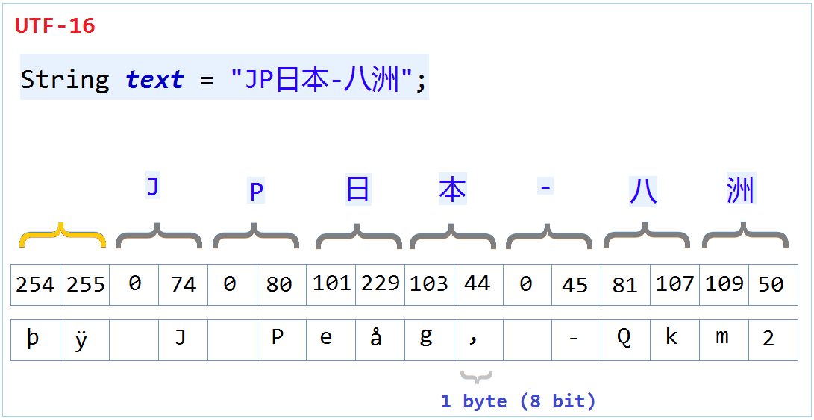
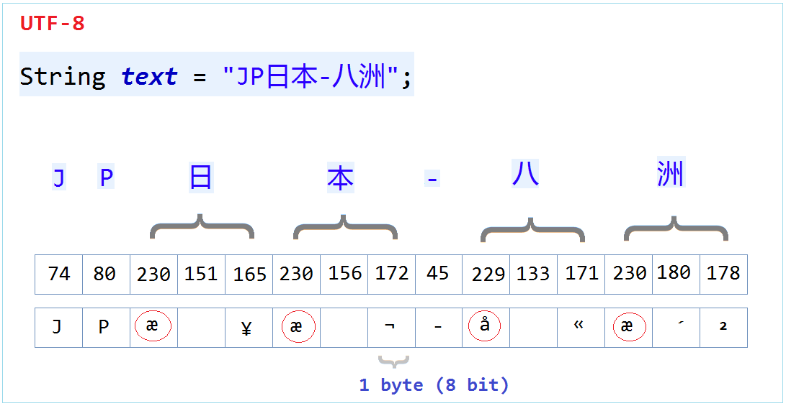
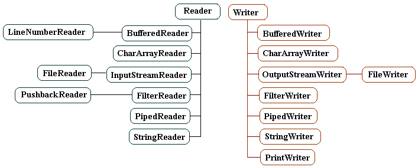
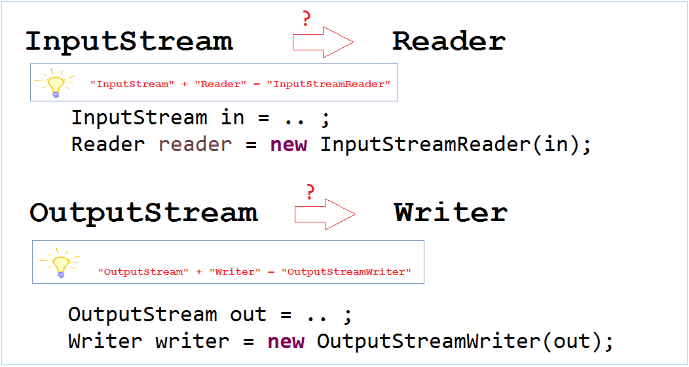

# 1.Hướng dẫn sử dụng luồng vào ra nhị phân trong Java
## 1.1- Tổng quan luồng nhị phân (Binary Stream)
Luồng nhị phân dẫn đầu bởi 2 class `InputStream` và `OutputStream` dưới 2 class này là rất nhiều các class con , nếu so sánh về lực lượng theo cách này mà nói thì họ hàng luồng nhị phân (Binary Stream) nhiều và phức tạp hơn hẳn so với họ hàng luồng ký tự (Charactor Stream).Với JDK1.5 trong luồng nhị phân có 2 class được khuyến cáo là không nên sử dụng là `LineNumberInputStream` và `StringBufferInputStream` vì đã bị lỗi thời . 



## 1.2- Class InputStream & OutputStream
Class `InputStream` là một class trừu tượng vì vậy bạn không thể khởi tạo đối tượng `InputStream` thông qua chính class `InputStream`. Tuy nhiên class này rẽ ra nhiều nhánh thông qua các class con thừa kế nó. Tùy vào các tình huống bạn có thể tạo đối tượng `InputStream` từ các Constructor của các class con.

```java
// java.io.InputStream là một class trìu tượng (abstract class)
// Không thể khởi tạo trực tiếp đối tượng InputStream thông qua class InputStream
// Nên khởi tạo đối tượng InputStream thông qua các class con của nó ..
 
InputStream fileStream =new FileInputStream("C:/test.txt");
 
// Luồng đầu vào từ bàn phím..
InputStream is = System.in;
```
Class `OutputStream` là một class trìu tượng vì vậy bạn không thể khởi tạo đối tượng `OutputStream` thông qua chính class `OutputStream` .Tuy nhiên class này rẽ ra nhiều nhánh thông qua các class con thừa kế nó và quan trọng .Tùy vào các tình huống bạn có thể tạo đối tượng `OutputStream` từ cấu tử của các class con. 

```java
// java.io.OutputStream là một class trìu tượng (abstract class)
// Không thể khởi tạo trực tiếp đối tượng OutputStream thông qua class OutputStream
// Nên khởi tạo đối tượng OutputStream thông qua các class con của nó ..
 
// Luồng ghi dữ liệu vào file
OutputStream os=new FileOutputStream("D:/outData.txt");
 
// Luồng ghi ra màn hình Console.
OutputStream w=System.out;
```

HelloInputStream.java

```java
public class HelloInputStream {

	public static void main(String[] args) {
		try {

			// Tạo một đối tượng InputStream theo class con của nó.
			// Đây là luồng đọc một file.
			InputStream is = new FileInputStream("data.txt");

			int i = -1;

			// Đọc lần lượt các byte trong luồng.
			// Mỗi lần đọc ra 8bit, chuyển nó thành số int.
			// Khi đọc ra giá trị -1 nghĩa là kết thúc luồng.

			while ((i = is.read()) != -1) {
				System.out.println(i + "  " + (char) i);
			}
			is.close();
		} catch (Exception e) {
			e.printStackTrace();
		}
	}
}
```
Kết quả: 

```
115  s
97  a
100  d
97  a
115  s
100  d
102  f
10  
```

HelloOutputStream.java

```java
package thuattoan.basic.stream;

import java.io.File;
import java.io.FileOutputStream;
import java.io.OutputStream;

/**
 * 
 * 
 * @author EMAIL:vuquangtin@gmail.com , tel:0377443333
 * @version 1.0.0
 * @see <a
 *      href="https://github.com/vuquangtin/algorithm">https://github.com/vuquangtin/algorithm</a>
 *
 */
public class HelloOutputStream {

	public static void main(String[] args) {
		try {
			// File dir = new File("C:/Test");
			// Tao thu muc C:/Test
			// dir.mkdirs();
			// Tạo một luồng ký tự đầu ra với mục đích ghi thông tin vào file
			OutputStream w = new FileOutputStream("test_outputStream.txt");

			// Tạo một mảng byte ,ta sẽ ghi các byte này vào file nói trên .
			byte[] by = new byte[] { 'H', 'e', 'l', 'l', 'o' };

			// Ghi lần lượt các ký tự vào luồng
			for (int i = 0; i < by.length; i++) {
				byte b = by[i];
				// Ghi ký tự vào luồng
				w.write(b);
			}
			// Đóng luồng đầu ra lại việc ghi xuống file hoàn tất.
			w.close();
		} catch (Exception e) {
			e.printStackTrace();
		}
	}
}
```

Kết quả: 

```
hello
```

2 Ví dụ phía trên là đơn giản, chúng đọc hoặc ghi từng byte, trong ví dụ tiếp theo chúng ta sẽ đọc hoặc ghi đồng  loạt nhiều byte, việc này làm tăng tốc việc xử lý. 

InputStreamExample2.java

```java
public class InputStreamExample2 {

	public static void main(String[] args) {
		try {
			// Tạo một luồng đầu vào bằng cách đọc một file
			InputStream in = new FileInputStream("data.txt");

			// Mảng để mỗi lần đọc các byte từ luồng thì tạm thời để lên đó
			// Ta dùng mảng 10 byte

			byte[] temp = new byte[10];
			int i = -1;

			// Đọc các byte trong luồng và gán lên các phần tử của mảng.
			// Giá trị i là số đọc được của 1 lần. (i sẽ <= 10).
			// Khi không còn phần tử trong luồng i sẽ = -1
			while ((i = in.read(temp)) != -1) {
				// Tạo String từ các byte đọc được
				String s = new String(temp, 0, i);
				System.out.println(s);
			}
			in.close();
		} catch (Exception e) {
			e.printStackTrace();
		}
	}
}
```

Đây là hình ảnh minh họa các lần đọc đồng loạt của ví dụ trên: 


OutputStreamExample2.java

```java
package thuattoan.basic.stream;

import java.io.File;
import java.io.FileOutputStream;
import java.io.OutputStream;

/**
 * 
 * 
 * @author EMAIL:vuquangtin@gmail.com , tel:0377443333
 * @version 1.0.0
 * @see <a
 *      href="https://github.com/vuquangtin/algorithm">https://github.com/vuquangtin/algorithm</a>
 *
 */

public class OutputStreamExample2 {

	public static void main(String[] args) {
		try {
			//File dir = new File("C:/Test");
			// Tao thu muc C:/Test
			//dir.mkdirs();

			// Tạo một luồng nhị phân đầu ra với mục đích ghi thông tin vào file
			OutputStream os = new FileOutputStream(
					"test_writerOutputStream.txt");

			// Tạo một mảng byte ,ta sẽ ghi các byte này vào file nói trên .
			byte[] by = new byte[] { 'H', 'e', 'l', 'l', 'o', ' ', 31, 34, 92 };
			byte[] by2 = new byte[] { 'H', 'e', 'l', 'l', 'o', ' ', 'b', 'o',
					'y' };

			// Ghi cả các byte trong mảng byte[] by vào luồng
			os.write(by);

			// Đẩy các byte hiện có trên luồng xuống file .
			os.flush();

			// Tiếp tục ghi các byte trong mảng thứ 2 vào luồng
			os.write(by2);

			// Đóng luồng vào công việc ghi thành công .
			os.close();
		} catch (Exception e) {
			e.printStackTrace();
		}
	}
}
```

## 1.3- Class ByteArrayInputStream & ByteArrayOutputStream 


`ByteArrayInputStream` bao bọc một mảng các byte (`byte[] buf`) và thông qua `ByteArrayInputStream` truy cập phần tử mảng ..
     
`ByteArrayOutputStream` là một luồng các byte, bên trong đối tượng này chứa một mảng các byte (`byte[] buf`) có khả năng tự tăng kích cỡ khi số byte của luồng tăng lên.Mỗi khi luồng được ghi vào các byte thì chính là gán tiếp byte đó vào các vị trí mảng chưa được gán ..

Khi mảng đầy phần tử thì chương trình tạo mảng mới có độ dài lớn hơn và copy các phần tử của mảng cũ vào ...(Đó là cách tự lớn lên của mảng các byte như đã nói trên)

Vài method của `ByteArrayOutputStream`: 

```java
// Mảng các byte chứa các byte của luồng ..
  - byte[] toByteArray();
 
// Chuyển về một String mô tả dẫy các byte trong luồng.
  - String toString() ;
 
// Trả về số vị trí được gán của mảng byte[] buf .
  - int size();
```

```java
package thuattoan.basic.stream;
import java.io.ByteArrayInputStream;
import java.io.IOException;
/**
 * 
 * 
 * @author EMAIL:vuquangtin@gmail.com , tel:0377443333
 * @version 1.0.0
 * @see <a
 *      href="https://github.com/vuquangtin/algorithm">https://github.com/vuquangtin/algorithm</a>
 *
 */


public class ByteArrayInputStreamExample {

	public static void main(String args[]) throws IOException {

		// Một mảng byte.
		byte[] bytes = new byte[] { 'H', 'e', 'l', 'l', 'o', ' ', 'I', 'O' };

		// Sử dụng ByteArrayInputStream để đọc dữ liệu mảng trên.
		ByteArrayInputStream bInput = new ByteArrayInputStream(bytes);

		System.out.println("Converting characters to Upper case ");
		int c = 0;

		// Đọc lần lượt các byte trong luồng.
		// Con trỏ sẽ di chuyển từ đầu mảng tới cuối mảng.
		// Mỗi lần đọc một byte con trỏ sẽ tiến 1 bước về cuối.
		while ((c = bInput.read()) != -1) {
			char ch = (char) c;
			ch = Character.toUpperCase(ch);
			System.out.println(ch);
		}

		// Kiểm tra xem stream này có hỗ trợ đánh dấu (mark) không.
		boolean markSupport = bInput.markSupported();

		System.out.println("Mark Support? " + markSupport);

		// Đưa con trỏ về vị trí mặc định
		// Trong ví dụ này nó sẽ đưa về vị trí 0.
		bInput.reset();

		char ch = (char) bInput.read();
		System.out.println(ch);

		// Đọc byte kế tiếp
		ch = (char) bInput.read();
		System.out.println(ch);

		System.out.println("Skip 4");
		// Nhẩy qua 4 vị trí
		bInput.skip(4);
		ch = (char) bInput.read();
		System.out.println(ch);

	}
}
```

## 1.4- Class ObjectInputStream & ObjectOutputStream

`ObjectInputStream`, `ObjectOutputStream` cho phép bạn đọc hoặc ghi một `Object` vào luồng. Các `Object` này phải là kiểu `Serializable` (Nghĩa là có thể sắp hàng).

Sau đây là một số class ví dụ: 

```java
import java.io.Serializable;
 
public class Student implements Serializable {
 
   private static final long serialVersionUID = -5074534753977873204L;
 
   private String firstName;
 
   private String lastName;
 
   public Student(String firstName, String lastName) {
       this.firstName = firstName;
       this.lastName = lastName;
   }
 
   public String getFirstName() {
       return firstName;
   }
 
   public void setFirstName(String firstName) {
       this.firstName = firstName;
   }
 
   public String getLastName() {
       return lastName;
   }
 
   public void setLastName(String lastName) {
       this.lastName = lastName;
   }
 
}
```

...


Đây là hình ảnh minh họa việc ghi các Object xuống file, việc ghi là lần lượt, sau này khi đọc ra bạn cũng phải nhớ thứ tự đã ghi trước đó để đọc cho đúng.



Và ví dụ với ObjectInputStream đọc file vừa được ghi ra tại ví dụ trên: 

```java
package thuattoan.basic.stream;

import java.io.FileInputStream;
import java.io.IOException;
import java.io.ObjectInputStream;
import java.util.Date;

/**
 * 
 * 
 * @author EMAIL:vuquangtin@gmail.com , tel:0377443333
 * @version 1.0.0
 * @see <a
 *      href="https://github.com/vuquangtin/algorithm">https://github.com/vuquangtin/algorithm</a>
 *
 */

public class ObjectInputStreamExample {

	public static void main(String[] args) throws IOException,
			ClassNotFoundException {

		// Tạo một luồng đọc file..
		FileInputStream fis = new FileInputStream("testObjectStream.txt");

		// Tạo đối tượng ObjectInputStream bao lấy 'fis'.
		ObjectInputStream ois = new ObjectInputStream(fis);

		// Đọc ra đối tượng String:
		String s = ois.readUTF();

		System.out.println(s);

		// Đọc ra đối tượng Date.
		Date date = (Date) ois.readObject();
		System.out.println("Date = " + date);

		Student student1 = (Student) ois.readObject();

		System.out.println("Student " + student1.getFirstName());

		Pupil pupil = (Pupil) ois.readObject();

		System.out.println("Pupil " + pupil.getFullName());

		Student student2 = (Student) ois.readObject();

		System.out.println("Student " + student2.getFirstName());

		ois.close();
	}
}
```

output

```
This is student, pupil profiles
Date = Wed Sep 23 14:03:25 ICT 2020
Student Thanh
Pupil Nguyen Van Ba
Student Ngan

```

## 1.5- Class DataInputStream & DataOutputStream 


**DataOutputStream** 

```java
/ Cấu tử
public DataOutputStream(OutputStream out)
 
// Ghi một ký tự 16 bit (2 byte)
public void writeChar(int val)
// Ghi một số double 64 bit (8-byte)
public void writeDouble(double val)
// Ghi một số float 32 bit (4-byte)
public void writeFloat(float val)
// Ghi một số tự nhiên 32 bit  (4-byte)
public void writeInt(int val)
// Ghi một String mã hóa dạng UTF-8.
public void writeUTF(String obj)
....
```

**DataInputStream**

```java
// Cấu tử
public DataInputStream(InputStream in)
 
// Đọc ra một ký tự (16 bit)
public char readChar()
// Đọc ra một số double (64 bit)
public double readDouble()
// Đọc ra một số float (32 bit)
public float readFloat()
// Đọc ra một số int (16 bit)
public int readInt()
// Đọc ra một String (mã hóa dạng UTF-8).
public String readUTF()
....
```

DataOutputStreamExample.java

```java
package thuattoan.basic.stream;
import java.io.DataOutputStream;
import java.io.File;
import java.io.FileOutputStream;
import java.io.IOException;
 
/**
 * 
 * 
 * @author EMAIL:vuquangtin@gmail.com , tel:0377443333
 * @version 1.0.0
 * @see <a
 *      href="https://github.com/vuquangtin/algorithm">https://github.com/vuquangtin/algorithm</a>
 *
 */

public class DataOutputStreamExample {
 
  public static void main(String[] args) throws IOException {
      int cityIdA = 1;
      String cityNameA = "Green Lake City";
      int cityPopulationA = 500000;
      float cityTempA = 15.50f;
 
      int cityIdB = 2;
      String cityNameB = "Salt Lake City";
      int cityPopulationB = 250000;
      float cityTempB = 10.45f;
 
      File dir = new File("C:/Test");
      dir.mkdirs();
 
      //
      // Tạo đối tượng FileOutputStream để ghi xuống file.
      //
      FileOutputStream fos = new FileOutputStream("C:/Test/cities.txt");
 
      // Tạo đối tượng DataOutputStream bao lấy 'fos'.
      // Dữ liệu ghi vào 'dos' sẽ được đẩy sang 'fos'.
      DataOutputStream dos = new DataOutputStream(fos);
 
      //
      // Ghi các dữ liệu vào luồng.
      //
      dos.writeInt(cityIdA);
      dos.writeUTF(cityNameA);
      dos.writeInt(cityPopulationA);
      dos.writeFloat(cityTempA);
 
      dos.writeInt(cityIdB);
      dos.writeUTF(cityNameB);
      dos.writeInt(cityPopulationB);
      dos.writeFloat(cityTempB);
 
      dos.flush();
      dos.close();
  }
 
}
```


Chạy class DataOutputStreamExample và nhận được một file dữ liệu được ghi ra. 

```java
package thuattoan.basic.stream;

import java.io.DataInputStream;
import java.io.FileInputStream;
import java.io.IOException;

/**
 * 
 * 
 * @author EMAIL:vuquangtin@gmail.com , tel:0377443333
 * @version 1.0.0
 * @see <a
 *      href="https://github.com/vuquangtin/algorithm">https://github.com/vuquangtin/algorithm</a>
 *
 */

public class DataInputStreamExample {

	public static void main(String[] args) throws IOException {

		// Luồng đọc dữ liệu từ file.
		FileInputStream fis = new FileInputStream("cities.txt");
		// Tạo đối tượng DataInputStream bao lấy 'fis'.
		DataInputStream dis = new DataInputStream(fis);

		//
		// Đọc dữ liệu.
		//
		int cityId1 = dis.readInt();
		System.out.println("Id: " + cityId1);
		String cityName1 = dis.readUTF();
		System.out.println("Name: " + cityName1);
		int cityPopulation1 = dis.readInt();
		System.out.println("Population: " + cityPopulation1);
		float cityTemperature1 = dis.readFloat();
		System.out.println("Temperature: " + cityTemperature1);

		//
		// Đọc dữ liệu.
		//
		int cityId2 = dis.readInt();
		System.out.println("Id: " + cityId2);
		String cityName2 = dis.readUTF();
		System.out.println("Name: " + cityName2);
		int cityPopulation2 = dis.readInt();
		System.out.println("Population: " + cityPopulation2);
		float cityTemperature2 = dis.readFloat();
		System.out.println("Temperature: " + cityTemperature2);

		dis.close();
	}
}
```
## 1.6- Dẫy luồng đầu vào nhị phân - SequenceInputStream 
Thông thường bạn đã quen thuộc với việc đọc một file nào đó và thu được một luồng đầu vào .Nhưng trong thực tế đôi khi bạn cần đọc từ nhiều file và lấy các dữ liệu đó ghép với nhau để ghi thành 1 file khác chẳng hạn .Vậy là ý tưởng ghép nhiều luồng đầu vào với nhau để thành một luồng lớn hơn nối đuôi nhau . Chúng ta đang nói đến class java.io.SequenceInputStream. Khái niệm này không có tương ứng cho luồng đầu ra ... 



```java
// Cấu tử :
 
  // Tạo một luồng đầu vào từ việc ghép luồng s2 nối tiếp với s1  
   public SequenceInputStream(InputStream s1,InputStream s2)  
    
   // Tạo một luồng đầu vào từ việc ghép một tập hợp các luồng đầu vào khác.
   public SequenceInputStream(Enumeration<? extends InputStream> e)
 
// Một vài method :
   // - Không có gì mới so với danh sách các method thấy trong class cha InputStream .
```

Ví dụ: 

```java
// Một luồng nhị phân đầu vào đọc từ một file File1.txt .
InputStream is1=new FileInputStream("File1.txt");
// Luồng mới đọc từ file File2.txt  
InputStream is2=new FileInputStream("File2.txt");
// Nối luồng is2 nối tiếp với luồng is1 thành một luồng nhị phân mới .
SequenceInputStream sis=new SequenceInputStream(is1,is2);
// Thao tác trên luồng đầu vào nhị phân SequenceInputStream sis như bình thường ...
```

## 1.7- Luồng dữ liệu đường ngầm nhị phân (PipedInputStream,PipedOutputStream) 



Đặt ra một tình huống bạn có 2 luồng một luồng đầu vào và một luồng đầu ra ...Chẳng hạn luồng đầu vào dữ liệu A đọc một file , lấy thông tin từ luồng này ghi vào luồng dữ liệu B đầu ra là một file khác .. Hai luồng A và B trong tình huống này là tách riêng nhau... Vì vậy trong ứng dụng bạn phải có 3 thao tác:

*         Tạo luồng dữ liệu đọc A
*         Tạo luồng ghi dữ liệu B
*         Đọc từ A ghi vào B ...

Hai thao tác đầu phải có, nhưng bạn muốn bỏ đi thao tác thứ 3 ... nghĩa là có một cái gì đó liên hệ ngầm với nhau giữa 2 luồng (vào-ra) ,để sao cho những byte xuất hiện trên luồng đầu đọc A lập tức được ghi tự động vào B.... Đó được gọi là liên hệ đường ngầm giữa 2 luồng vào và ra ..

DataInputStreamExample.java

```java
package thuattoan.basic.stream;

import java.io.DataInputStream;
import java.io.FileInputStream;
import java.io.IOException;

/**
 * 
 * 
 * @author EMAIL:vuquangtin@gmail.com , tel:0377443333
 * @version 1.0.0
 * @see <a
 *      href="https://github.com/vuquangtin/algorithm">https://github.com/vuquangtin/algorithm</a>
 *
 */

public class DataInputStreamExample {

	public static void main(String[] args) throws IOException {

		// Luồng đọc dữ liệu từ file.
		FileInputStream fis = new FileInputStream("cities.txt");
		// Tạo đối tượng DataInputStream bao lấy 'fis'.
		DataInputStream dis = new DataInputStream(fis);

		//
		// Đọc dữ liệu.
		//
		int cityId1 = dis.readInt();
		System.out.println("Id: " + cityId1);
		String cityName1 = dis.readUTF();
		System.out.println("Name: " + cityName1);
		int cityPopulation1 = dis.readInt();
		System.out.println("Population: " + cityPopulation1);
		float cityTemperature1 = dis.readFloat();
		System.out.println("Temperature: " + cityTemperature1);

		//
		// Đọc dữ liệu.
		//
		int cityId2 = dis.readInt();
		System.out.println("Id: " + cityId2);
		String cityName2 = dis.readUTF();
		System.out.println("Name: " + cityName2);
		int cityPopulation2 = dis.readInt();
		System.out.println("Population: " + cityPopulation2);
		float cityTemperature2 = dis.readFloat();
		System.out.println("Temperature: " + cityTemperature2);

		dis.close();
	}
}
```

## 1.8- Class PrintStream 

```java
// PrintStream là class con trực tiếp của FilterOutputStream .
// Nó có thể bao bọc một luồng đầu ra nhị phân (OutputStream) , ..
// Cấu tử :
 
   // Bao bọc một luồng nhị phân
   public PrintStream(OutputStream out)
 
   public PrintStream(OutputStream out,boolean autoFlush)
   // Ghi thông tin vào file ..
   public PrintStream(String fileName)
   // ...(Xem javadoc) .
 
// Một số method
   public void println(String s)
   public void print(char ch)
   // Ghi một đối tượng vào luồng .
   public void print(Object obj)
   // Ghi một số tự nhiên 64 bit vào luồng .  
   public void print(long n)
   public PrintStream append(java.lang.CharSequence csq) .
   // ... (chi tiết xem javadoc) .
```

Bạn đã quen biết với bắt ngoại lệ Exception thông qua khối try, catch. 

```java
try {    
 // Làm một điều gì đó trong khối try ...  
 // Lỗi chia cho 0
 int i=10/0;
}
// Có điều gì đó sai xót trong khi chạy khối try khối catch được chạy
catch(Exception e) {  
 // In ra lý do sai xót trong khi chạy    
 System.out.println("Error on try..."+e.getMessage());
 // In ra thông tin quá trình chạy lỗi xuất hiện ở các vị trí nào ra màn hình Console
 // Làm sao để lấy được đoạn text "stack trace" ?
 e.printStackTrace();
}
```

see https://o7planning.org/vi/10163/huong-dan-su-dung-luong-vao-ra-nhi-phan-trong-java
# 2.Hướng dẫn sử dụng luồng vào ra ký tự trong Java 
## 2.1- Giới thiệu

Trong bài học trước tôi đã giới thiệu về luồng vào ra nhị phân (input-output binary stream), bạn cần phải hiểu về nó trước khi tìm hiểu về luồng vào ra ký tự (input-output character stream), bạn có thể xem tại đây

## 2.2- Sự khác biệt giữa luồng nhị phân và luồng ký tự 
Luồng nhị phân (binary stream), mỗi một lần đọc/ghi một byte (Tương đương với 8 bit) 


Trong khi đó luồng ký tự (character stream) mỗi lần đọc/ghi một ký tự, tùy thuộc vào kiểu mã hóa (encoding) ( UTF-8, UTF-16,..) mà ký tự đó tương đương với 1, 2 hoặc 3 byte. Chúng ta hãy xem một hình ảnh minh họa sau: 


**UTF-16:**

Đây là một đoạn văn bản tiếng Nhật, nếu nó được lưu tại File với mã hóa UTF-16 (UTF-16 encoding), lúc đó các byte dưới ổ cứng sẽ giống hình minh họa:

* Hai byte đầu tiên (254,255) chỉ có ý nghĩa thông báo rằng, nó là bắt đầu của một chuỗi có mã hóa UTF-16.
* Các ký tự tiếp theo đều được mã hóa bởi 2 byte.
 * Ví dụ như ký tự 'J' được mã hóa bởi 2 byte (0 và 74)
 * Ký tự 'P' được mã hóa bởi 2 byte (0 và 80)
 * ....
* Khi đọc từ file lên theo mã hóa UTF-16, nó sẽ bỏ 2 byte đầu tiên, và đọc 2 byte liên tiếp ghép lại thành một ký tự.



**UTF-8:**
Cũng dòng văn bản tiếng Nhật nói trên nếu được ghi xuống file với mã hóa UTF-8 lúc đó sẽ khác đi, hãy xem các byte được lưu xuống ổ cứng:

*  Đối với các ký tự ASCII, nó sẽ chỉ dùng 1 byte để lưu trữ.
 * Ví dụ, nó dùng 1 byte để lưu trữ ký tự 'J' (74).
 * Dùng 1 byte để lưu trữ ký tự 'P' (80).
* Các ký tự khác nó có thể dùng 2 byte hoặc 3 byte để lưu.
* Quy tắc để đọc 1 ký tự, dựa vào một bảng mã UTF-8 (UTF-8 Table).
 * Đọc byte đầu tiên, nếu <= 127, thì đó là 1 ký tự ASCII.
 * Ngược lại nếu > 127, thì nó cần đọc tiếp byte thứ 2, và kiểm tra xem 2 byte đó có ghép được thành 1 ký tự dựa vào bảng mã UTF-8 hay không.
 * Nếu 2 byte đầu tiên không tương ứng với một ký tự, nó đọc tiếp byte thứ 3 và ghép thành 1 ký tự.
 * UTF-8 dùng tối đa 3 byte để lưu trữ một ký tự.



>Như vậy khi bạn lưu một văn bản với mã hóa (encoding) gì, cần phải đọc ra với mã hóa tương ứng, nếu không việc đọc ra sẽ cho kết quả sai.

## 2.3- Tổng quan về luồng vào ra ký tự 
Sơ đồ phân cấp các lớp: 


## 2.4- Class java.io.Reader
Reader là một lớp trừu tượng, nó là lớp cơ sở cho các luồng đọc ký tự.
Tạo một file test_reader.txt để bắt đầu một ví dụ với Reader:

```java
package thuattoan.basic.stream;
import java.io.FileReader;
import java.io.IOException;
import java.io.Reader;

/**
 * 
 * 
 * @author EMAIL:vuquangtin@gmail.com , tel:0377443333
 * @version 1.0.0
 * @see <a
 *      href="https://github.com/vuquangtin/algorithm">https://github.com/vuquangtin/algorithm</a>
 *
 */

public class HelloReader {

	public static void main(String[] args) throws IOException {
		// Tạo một Reader (Luồng ký tự), để đọc một file.
		// Với mã hóa (encoding) mặc định.
		Reader r = new FileReader("test_reader.txt");
		int i = -1;

		// Đọc lần lượt từng ký tự trong luồng.
		while ((i = r.read()) != -1) {
			// Ép về (cast) thành kiểu ký tự.
			System.out.println((char) i);
		}
		r.close();
	}

}
```

Ví dụ tiếp theo sẽ đọc nhiều ký tự trong một lần đọc. Cách này làm tăng hiệu năng chương trình so với cách đọc lần lượt từng ký tự. 

```java
import java.io.FileReader;
import java.io.IOException;
import java.io.Reader;
 
// Ví dụ này sẽ đọc nhiều ký tự trong một lần.
public class HelloReader2 {
 
    public static void main(String[] args) throws IOException {
 
        // Tạo một đối tượng Reader đọc một file.
        // Với mã hóa (encoding) mặc định. 
        Reader r = new FileReader("test_reader.txt");
        // Tạo một mảng tạm.
        char[] temp = new char[10];
        int i = -1;
 
        // Phương thức read(char[]):
        // Đọc nhiều ký tự trong một lần, và gán vào các phần tử của mảng. 
        // Trả về số ký tự đọc được.
        // Trả về -1 nếu luồng (stream) kết thúc.
        while ((i = r.read(temp)) != -1) {
            String s = new String(temp, 0, i);
            System.out.println(s);
        }
        r.close(); 
    }
 
}
```

## 2.5- Class java.io.Writer 

Writer là một lớp trừu tượng, nó là lớp cơ sở cho các luồng ghi ký tự. 

```java
import java.io.File;
import java.io.FileWriter;
import java.io.IOException;
import java.io.Writer;
 
public class HelloWriter {
 
    public static void main(String[] args) throws IOException {
        File dir = new File("C:/test");
 
        // Tạo thư mục 'C:/test', nếu nó chưa tồn tại.
        dir.mkdirs();
 
        // Tạo một đối tượng Writer, để ghi dữ liệu vào file.
        // Với mã hóa (encoding) mặc định.
        Writer w = new FileWriter("C:/test/test_writer.txt");
 
        // Mảng các ký tự.
        char[] chars = new char[] { 'H', 'e', 'l', 'l', 'o', // 
                ' ', 'w', 'r', 'i', 't', 'e', 'r' };
 
        // Ghi lần lượt các ký tự vào luồng (stream).
        for (int i = 0; i < chars.length; i++) {
            char ch = chars[i];
            int j = (int) ch;
            // 
            w.write(j);
        }
        // Đóng luồng (Close stream),
        w.close();
    }
}
```


Ví dụ tiếp theo, ghi nhiều ký tự vào luồng cùng một lúc. Cụ thể là ghi một mảng các ký tự vào luồng. Việc làm này nâng cao hiệu năng chương trình so với việc ghi lần lượt từng ký tự. 


```java
import java.io.File;
import java.io.FileWriter;
import java.io.IOException;
import java.io.Writer;
 
public class HelloWriter2 {
 
    public static void main(String[] args) throws IOException {
 
        File dir = new File("C:/test");
        // Tạo thư mục 'C:/test' nếu nó chưa tồn tại.
        dir.mkdirs();
 
        // Tạo một đối tượng Writer, để ghi dữ liệu vào file.
        Writer w = new FileWriter("C:/test/test_writer2.txt");
 
        // 
        char[] chars = new char[] { 'H', 'e', 'l', 'l', 'o', //
                ' ', 'w', 'r', 'i', 't', 'e', 'r' };
 
        // Ghi tất cả các ký tự trong mảng vào luồng.
        w.write(chars);
 
        // Thông thường Java sử dụng bộ đệm (buffer)
        // để lưu trữ dữ liệu một cách tạm thời.
        // Khi bộ đệm (buffer) đầy, dữ liệu sẽ được đẩy (flush) xuống file.
        // Bạn cũng có thể chủ động đẩy (flush) dữ liệu xuống file.
        w.flush();
 
        // Ghi ký tự xuống dòng (new line character) vào luồng.
        w.write('\n');
 
        String s = "FileWriter";
 
        // Ghi một chuỗi vào luồng (stream).
        w.write(s);
 
        // Đóng luồng (Close stream).
        // Nó sẽ đẩy các dữ liệu trên bộ đệm (buffer) vào file.
        // Đồng thời kết thúc việc ghi dữ liệu.
        w.close();
    }
}
```

## 2.6- Làm thế nào để chuyển một luồng nhị phân thành luồng ký tự?
    Bạn có một luồng nhị phân (binary stream). Và bạn muốn chuyển nó thành luồng ký tự (character stream)?




Trên các ví dụ trên chúng ta làm quen với Reader, Writer. Ví dụ tiếp theo cho phép bạn chủ động đọc và ghi dữ liệu vào luồng với một mã cụ thể.

Tạo một file test_utf8.txt

InputStreamReaderExample.java 

```java
package thuattoan.basic.stream;
import java.io.FileInputStream;
import java.io.IOException;
import java.io.InputStream;
import java.io.InputStreamReader;
import java.io.Reader;
/**
 * 
 * 
 * @author EMAIL:vuquangtin@gmail.com , tel:0377443333
 * @version 1.0.0
 * @see <a
 *      href="https://github.com/vuquangtin/algorithm">https://github.com/vuquangtin/algorithm</a>
 *
 */

 
public class InputStreamReaderExample {
 
    public static void main(String[] args) throws IOException {
 
        // Tạo một binary Stream (luồng nhị phân), để đọc file.
        InputStream in = new FileInputStream("test_utf8.txt");
 
        // Tạo một Character stream (luồng ký tự) bao lấy (wrap) luồng nhị phân trên.
        // Với mã hóa (encoding) là UTF-8.
        Reader reader = new InputStreamReader(in, "UTF-8");
 
        int i = 0;
        // Đọc lần lượt từng ký tự.
        while ((i = reader.read()) != -1) {
            // Ép kiểu (cast) thành một ký tự và in ra màn hình.
            System.out.println((char) i + " " + i);
        }
        reader.close();
    }
}
```

Kết quả chạy ví dụ 

```
J 74
P 80
日 26085
本 26412
- 45
八 20843
洲 27954
```

Ví dụ tiếp theo, ghi ra file chỉ định rõ mã hóa UTF-8. 

```java
import java.io.File;
import java.io.FileOutputStream;
import java.io.IOException;
import java.io.OutputStream;
import java.io.OutputStreamWriter;
import java.io.Writer;
 
public class OutputStreamWriterExample {
 
    public static void main(String[] args) throws IOException {
         
        File dir = new File("C:/test");
        // Tạo thư mục 'C:/test' nếu nó không tồn tại.
        dir.mkdirs();
        // Tạo một OutputStream (luồng đầu ra) để ghi dữ liệu vào file.
        OutputStream out = new FileOutputStream("C:/test/test_write_utf8.txt");
 
        // Tạo một Character Stream (luồng ghi ký tự) bao lấy OutputStream ở trên.
        // Mã hóa (encoding) là UTF-8.
        Writer writer = new OutputStreamWriter(out, "UTF-8");
 
        String s = "JP日本-八洲";
        writer.write(s);
        writer.close();
    }
 
}
```

## 2.7- Class java.io.BufferedReader 
Nếu bạn muốn đọc từng dòng dữ liệu của một file văn bản. BufferedReader là một sự lựa chọn tốt. 


```java
// BufferedReader là một lớp con trực tiếp của Reader .
// Constructor:
public BufferedReader(Reader in);
 
// Một phương thức tiện lợi có được từ BufferedReader.
// Đọc một dòng văn bản.
public String readLine();
```

Ví dụ: 

```java
// Ví dụ 1:
Reader r=new FileReader("C:/test.txt");
BufferedReader br=new BufferedReader(r);
 
// Ví dụ 2:
InputStream in = new FileInputStream("C:/test.txt");
Reader r = new InputStreamReader(in, "UTF-8");
BufferReader br = new BufferedReader(r);
```

test_multi_lines.txt

```
## Fruit List
Apricots
Barbados Cherries
Bitter Melon
Cherimoya
Honeydew
Jackfruit
Limes
Lychee
Mango
Oranges
Pineapple
Strawberries
```

```java
import java.io.BufferedReader;
import java.io.FileInputStream;
import java.io.IOException;
import java.io.InputStream;
import java.io.InputStreamReader;
import java.io.Reader;
 
public class BufferedReaderExample {
 
    public static void main(String[] args) throws IOException {
 
        InputStream in = new FileInputStream("test_multi_lines.txt");
        Reader reader = new InputStreamReader(in, "UTF-8");
        BufferedReader br = new BufferedReader(reader);
 
        String s = null;
        int i = 0;
 
        // Đọc từng dòng (line) dữ liệu.
        // Nếu đọc được null nghĩa là kết thúc Stream.
        while ((s = br.readLine()) != null) {
            i++;
            System.out.println(i + " : " + s);
        }
        br.close();
    }
 
}
```

## 2.8- Class java.io.BufferedWriter 
`BufferedWriter` là một lớp con trực tiếp của lớp `Writer`. 

```java
// Tạo một đối tượng BufferedWriter 
// bằng cách gói (wrap) một đối tượng Writer khác.
public BufferedWriter(Writer out);
 
// Tương đương với write('\n'); 
public String newLine();
```

Ví dụ: 

```java
// Tạo đối tượng Writer.
Writer w=new FileWriter("C:/test/test_bufferedWriter.txt");
 
// Tạo một đối tượng BufferedWriter bao lấy (wrap) một writer.
BufferedWriter bw=new BufferedWriter(w);
 
bw.write("Hello..");
 
// Ghi một ký tự xuống dòng '\n'.
bw.newLine();
```

## 2.9- Class java.io.FilterReader
`FilterReader` là một lớp con của lớp `Reader`. Nó đọc một cách có chọn lọc các ký tự theo yêu cầu. Chẳng hạn bạn muốn đọc một văn bản HTML, và bỏ qua các ký tự trong các thẻ (tag). Bạn cần viết một lớp con của FilterReader và sau đó sử dụng lớp con đó, bạn không thể sử dụng trực tiếp FilterReader vì nó là một lớp trừu tượng (abstract class).

Ví dụ, tạo một lớp con của lớp FilterReader, đọc dữ liệu HTML nhưng bỏ qua các ký tự trong thẻ.

Ví dụ đầu vào "<h1>Hello</h1>" ==> đọc ra "Hello".

```java
import java.io.FilterReader;
import java.io.IOException;
import java.io.Reader;
 
public class RemoveHTMLReader extends FilterReader {
 
    boolean intag = false;
 
    public RemoveHTMLReader(Reader in) {
        super(in);
    }
 
    // Chúng ta ghi đè (override) phương thức này.
    // Nguyên tắc sẽ là:
    // Chỉ đọc các ký tự nằm ngoài các thẻ (tag).
    @Override
    public int read(char[] buf, int from, int len) throws IOException {
 
        int charCount = 0;
 
        while (charCount == 0) {
 
            charCount = super.read(buf, from, len);
            if (charCount == -1) {
                // Kết thúc stream.
                return -1;
            }
 
            int last = from;
 
            for (int i = from; i < from + charCount; i++) {
                // Nếu không nằm trong thẻ HTML.
                if (!intag) {
                    if (buf[i] == '<') {
                        intag = true;
                    } else {
                        buf[last++] = buf[i];
                    }
                } else if (buf[i] == '>') {
                    intag = false;
                }
            }
 
            charCount = last - from;
        }
        return charCount;
    }
 
    // Cũng cần ghi đè phương thức này.
    @Override
    public int read() throws IOException {
        char[] buf = new char[1];
        int result = read(buf, 0, 1);
        if (result == -1) {
            return -1;
        } else {
            return (int) buf[0];
        }
    }
}
```

```java
import java.io.BufferedReader;
import java.io.IOException;
import java.io.Reader;
import java.io.StringReader;
 
public class RemoveHTMLReaderTest {
 
    public static void main(String[] args) throws IOException {
 
        // Tạo một đối tượng Reader từ Constructor của StringReader.
        Reader in = new StringReader("<h1>Hello \n <b>World</b><h1>");
 
        RemoveHTMLReader filterReader = new RemoveHTMLReader(in);
        BufferedReader br = new BufferedReader(filterReader);
 
        String s = null;
        while ((s = br.readLine()) != null) {
            System.out.println(s);
        }
        br.close();
    }
}
```

## 2.10- Class java.io.FilterWriter 


FilterWriter là một lớp con trực tiếp của Writer, nó ghi một cách có chọn lọc các ký tự theo yêu cầu. Bạn cần viết một lớp con của FilterWriter và có ghi đè (override) một vài phương thức của lớp FilterWriter.

Ví dụ: Các ký tự bị thay đổi khi ghi vào luồng. 

```java
public class Rot13 {
     
    /**
     * <pre>
     *   a ==> n
     *   b ==> o
     *   c ==> p
     *   d ==> q
     *   e ==> r
     *   ...
     *   y ==> l
     *   z ==> m
     * </pre>
     */
    public static int rotate(int inChar) {
        int outChar;
         
        if (inChar >= (int) 'a' && inChar <= (int) 'z') {
            outChar = (((inChar - 'a') + 13) % 26) + 'a';
        } else if (inChar >= (int) 'A' && inChar <= (int) 'Z') {
            outChar = (((inChar - 'A') + 13) % 26) + 'A';
        } else {
            outChar = inChar;
        }
        return outChar;
    }
     
    // Test
    public static void main(String[] args)  {
        for(char ch='a'; ch<='z';ch++ ) {
            char m= (char)rotate(ch);
            System.out.println("ch="+ch+" ==> "+ m);    
        }      
         
    }
}
```


```java
import java.io.FilterWriter;
import java.io.IOException;
import java.io.Writer;
 
public class RotateWriter extends FilterWriter {
  
    public RotateWriter(Writer out) {
        super(out);
    }
 
    // Ghi đè một hoặc nhiều phương thức để sử lý việc lọc.
    // (Ghi đè cả 2 phương thức sẽ an toàn hơn).
    @Override
    public void write(int outChar) throws IOException {
        super.write(Rot13.rotate(outChar));
    }
 
    @Override
    public void write(char[] cbuf, int offset, int length) throws IOException {
        char[] tempbuf = new char[length];
        for (int i = 0; i < length; i++) {
            tempbuf[i] = (char) Rot13.rotate(cbuf[offset + i]);
        }
        super.write(tempbuf, 0, length);
    }
 
}
```

```java
import java.io.IOException;
import java.io.StringWriter;
import java.io.Writer;
 
public class RotateWriterTest {
 
     
    public static void main(String[] args) throws IOException  {
        String s="abcdef";
         
        Writer writer= new StringWriter();
         
        RotateWriter rw= new RotateWriter(writer);
        rw.write(s.toCharArray(),0,s.length());
         
        rw.close();
         
        String rotateString = writer.toString();
        System.out.println("rotateString="+ rotateString);
    }
}
```

## 2.11- Class java.util.PushbackReader
Lớp PushbackReader cho phép một hoặc nhiều ký tự để được đặt trở lại (push back) cho luồng sau khi đã đọc chúng ra. Dưới đây là hai Constructor của nó:


```java
public PushbackReader(Reader inputStream)
 
public PushbackReader(Reader inputStream, int bufSize)
```

Một số phương thức bổ xung: 

```java
// Đặt trở lại (push back) một ký tự về luồng.
public void unread(int c) throws IOException
```


```java
import java.io.CharArrayReader;
import java.io.IOException;
import java.io.PushbackReader;
 
class PushbackReaderDemo {
 
    public static void main(String args[]) throws IOException {
        String s = "if (a == 4) a = 0;\\n";
        char buf[] = new char[s.length()];
        s.getChars(0, s.length(), buf, 0);
        CharArrayReader in = new CharArrayReader(buf);
        PushbackReader f = new PushbackReader(in);
        int c;
        while ((c = f.read()) != -1) {
            switch (c) {
            // Tìm thấy ký tự '='
            case '=':
                // Đọc tiếp một ký tự nữa.
                // (Sau khi đã tìm thấy ký tự '=' trước đó).
                if ((c = f.read()) == '=') {
                    System.out.print(".eq.");
                }
 
                else {
                    System.out.print("<-");
                    // Đẩy trở lại (Pushes back) ký tự này lên luồng.
                    // Giống như lùi con trỏ trở lại 1 vị trí.
                    f.unread(c);
                }
                break;
            default:
                System.out.print((char) c);
                break;
            }
        }
    }
 
}
```

....

see https://o7planning.org/vi/10173/huong-dan-su-dung-luong-vao-ra-ky-tu-trong-java