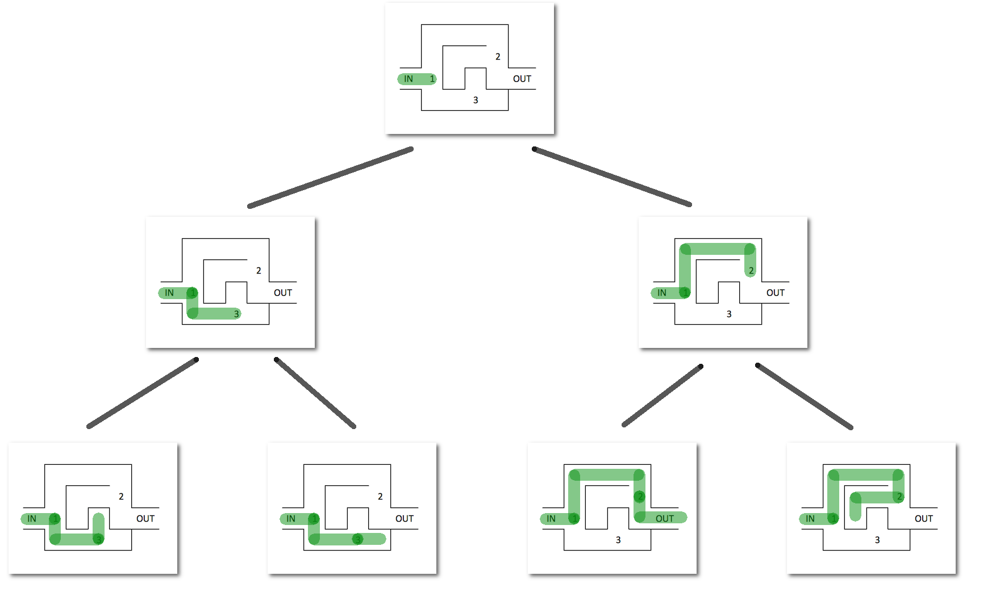
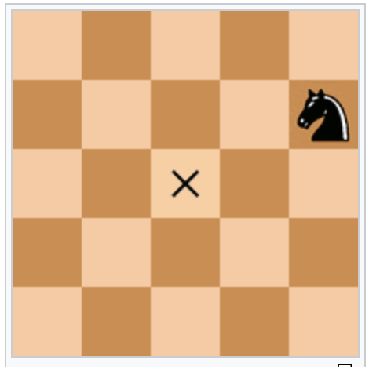
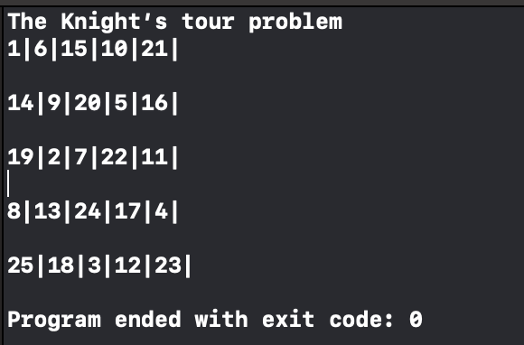

# Thuật toán quay lui

## Tổng quan

Thuật toán quay lui dùng để giải bài toán liệt kê các cấu hình. Mỗi cấu hình được xây dựng bằng cách xây dựng từng phần tử, mỗi phần tử được chọn bằng cách thử tất cả các khả năng. Cấu hình ở đây ta có thể hiểu là **các cách sắp xếp một tập các phần tử** (liệt kê hoán vị) hoặc **các cách xây dựng một tập phần tử từ tập phần tử cho trước** (xây dựng tập con). Trong những tình huống khác, bài toán có thể yêu cầu liệt kê các cây khung (spanning trees) của đồ thị. Liệt kê các đường đi có thể giữa hai đỉnh. Các cách tô màu các đỉnh của đồ thị sao cho hai đỉnh kề khác màu nhau,... (đây là các bài toán mình sẽ giới thiệu ở phần đồ thị nha).

<p align = "center"></p>

## Kĩ thuật

Điểm chung của các bài toán có thể áp dụng quay lui để giải là ta phải tạo ra một cấu hình **chính xác một lần**, tránh liệt kê cấu hình bị lặp và bị thiếu. Điều đó đồng nghĩa với việc ta phải tạo ra một cách liệt kê **trật tự và có hệ thống**. 

Giả thiết cấu hình cần liệt kê có dạng (x<sub>1</sub>, x<sub>2</sub>,... ,x<sub>n</sub>). Khi đó thuật toán quay lui thực hiện qua các bước sau: 
* Xét tất cả các giá trị x<sub>1</sub> có thể nhận, thử cho x<sub>1</sub> nhận lần lượt các giá trị đó. Với mỗi giá trị thử gán cho x<sub>1</sub> ta sẽ:
  * Xét tất cả các giá trị x<sub>2</sub> có thể nhận, lại thử cho x<sub>2</sub> nhận lần lượt các giá trị đó. Với mỗi giá trị thử gán cho x<sub>2</sub> lại tiếp tục xét tất cả các khả năng chọn x<sub>3</sub> ... cứ tiếp tục như vậy cho đến bước n.
  ...
    * Xét tất cả giá trị x<sub>n</sub> có thể nhận, thử cho x<sub>n</sub> nhận lần lượt các giá trị đó, thông báo cấu hình tìm được (x<sub>1</sub>, x<sub>2</sub>,... ,x<sub>n</sub>).
    
Mã giả:

```C++

void Try(int i){
  for(mọi giá trị có thể gán cho x[i]){
    x[i] = j;
    <Đánh dấu đã chọn x[i] nếu cần>;
    if(x[i] là phần tử cuối của cấu hình){
      <Thông báo cấu hình tìm được>;
    }
    else Try(i+1) // gọi đệ quy để chọn tiếp x[i+1]
    <Xóa đánh dấu đã chọn x[i] nếu cần>;
  }
}

```
Thuật toán quay lui bắt đầu bằng lời gọi Try(giá trị ban đầu)

## Ví dụ

### Liệt kê dãy nhị phân có độ dài n

**Đề bài**: Bạn có thể xem lại ở [đây](https://github.com/hieptran1812/Algorithm-for-ITPTIT/blob/master/Complete%20Search/Generation%20method.md)

**Ý tưởng**:

Sử dụng các bước cơ bản của quay lui hoy :))

**Code**:

```C++

#include<bits/stdc++.h>
using namespace std;

int a[100];
void Try(int i, int n){
	for(int j = 0; j <= 1; j++){
		a[i] = j;
		if (i == n-1){
			for (int k = 0; k < n; k++){
				cout << a[k];
			}
			cout << endl;
		}
		else Try(i+1, n);
	}
}

main(){
	int n;
	cin >> n;
	Try(0, n);
}

```

### Bài toán 8 quân hậu

**Đề bài**: Nhiệm vụ của bạn là liệt kê các cách xếp 8 quân hậu lên bàn cờ sao cho chúng không chiếu nhau. (Các bạn biết chơi cờ chứ :>)

<p align = "center"></p>

**Ý tưởng**:

Các quân hậu sẽ chiếu nhau nếu chúng cùng nằm trên hàng ngang hoặc hàng dọc hoặc đường chéo. Có rất nhiều cách tiếp cận bài toán này nhưng tớ sẽ sử dụng hướng quay lui để giải nha :))

```
1) Bắt đầu ở cột ngoài cùng bên trái.

2) Nếu tất cả quân hậu được đặt -> return true.

3) Thử tất cả các hàng trong cột hiện tại. Làm các bước dưới đây cho mỗi hàng đã duyệt. 
a) Nếu quân hậu có thể được đặt an toàn trong hàng này thì đánh dấu [hàng, cột] này là một phần của giải pháp và đệ quy tới các quân hậu tiếp theo.
b) Nếu đặt quân hậu vào [hàng, cột] dẫn đến một giải pháp thì return true. 
c) Nếu việc đặt quân hậu không dẫn đến một giải pháp thì bỏ đánh dấu [hàng, cột] (Backtrack) này và đi đến bước (a) để thử các hàng khác. 

3) Nếu tất cả các hàng đã được thử và không tìm được vị trí đặt quân hậu, return false để kích hoạt quay lui.

```

**Code**:

```C

#include<bits/stdc++.h>
#define N 4 //Kích thước bàn cờ
  
/* Hàm in Solution */
void printSolution(int board[N][N]) 
{ 
    for (int i = 0; i < N; i++) { 
        for (int j = 0; j < N; j++) 
            printf(" %d ", board[i][j]); 
        printf("\n"); 
    } 
} 
  
/* Hàm kiểm tra vị trí quân hậu mới có bị chiếu không */
bool isSafe(int board[N][N], int row, int col) 
{ 
    int i, j; 
  
    /* check hàng hiện tại ở bên trái */
    for (i = 0; i < col; i++) 
        if (board[row][i]) 
            return false; 
  
    /* check đường chéo trên */
    for (i = row, j = col; i >= 0 && j >= 0; i--, j--) 
        if (board[i][j]) 
            return false; 
  
    /* check đường chéo dưới */
    for (i = row, j = col; j >= 0 && i < N; i++, j--) 
        if (board[i][j]) 
            return false; 
  
    return true; 
} 
  
/* Hàm đệ quy giải bài toán quân hậu */
bool solveNQUtil(int board[N][N], int col) 
{ 
    /* nếu tất cả các cột đều đã duyệt (hay tất cả quân hậu đều được đặt */
    if (col >= N) 
        return true; 
  
    /* Xét cột hiện tại bằng cách duyệt hết các hàng */
    for (int i = 0; i < N; i++) { 
        /* Nếu quân hậu đặt ở vị trí board[i][col] */
        if (isSafe(board, i, col)) { 
            /* Đặt quân hậu ở vị trí board[i][col] */
            board[i][col] = 1; 
  
            /* Đệ quy để đặt tiếp các quân hậu ở cột khác */
            if (solveNQUtil(board, col + 1)) 
                return true; 
  
            /* Nếu đặt quân hậu ở vị trí board[i][col] 
              	không giúp ta tìm ra được giải pháp (không thể đặt được vị trí quân hậu tiếp theo) */
            board[i][col] = 0; // BACKTRACK 
        } 
    } 
  
    /* Nếu không tìm được vị trí đặt hậu phù hợp thì return false */
    return false; 
} 
  
bool solveNQ() 
{ 
    int board[N][N] = { { 0, 0, 0, 0 }, 
                        { 0, 0, 0, 0 }, 
                        { 0, 0, 0, 0 }, 
                        { 0, 0, 0, 0 } }; 
  
    if (solveNQUtil(board, 0) == false) { 
        printf("Solution does not exist"); 
        return false; 
    } 
  
    printSolution(board); 
    return true; 
} 
  
int main() 
{ 
    solveNQ(); 
    return 0; 
} 

```
Một cách khác (cách này theo hướng và vấn đề khác cách trên nha):

```C

#include<bits/stdc++.h>
int a[20];
bool Ok(int x2,int y2){
    //kiểm tra cách đặt có thỏa mãn không
    for(int i = 1; i < x2 ;i++)
        if(a[i] == y2 || abs(i-x2) == abs(a[i] - y2) )
            return false;
    //Nếu kiểm tra hết các trường hợp vẫn không sai thì trả về true
    return true;
}
 
void Xuat(int n){
    //in ra một kết quả
    for(int i=1;i<=n;i++)
        printf(" %d",a[i]);
    printf("\n");
}
 
void Try(int i,int n){
    for(int j = 1;j<=n;j++){
        // thử đặt quân hậu vào các cột từ 1 đến n
        if(Ok(i,j)){
            //nếu cách đặt này thỏa mãn thì lưu lại vị trí
            a[i] = j;
            //nếu đặt xong quân hậu thứ n thì xuất ra một kết quả
            if(i==n) Xuat(n);
            Try(i+1,n);
        }
    }
}
 
int main(){
    int n = 8;// bài toán là 8 quân hậu trên bàn 8*8
    Try(1,n);
    return 0;
}

```
### Thuật toán Quay lui (Backtracking) với bài toán con mã đi hết bản đồ.


Bài toán này đặt ra một yêu cầu khá thú vị. Tìm đường cho con Mã có thể đặt chân đến tất cả các điểm trên bàn cờ với mỗi vị trí con Mã chỉ được đi đến duy nhất **một lần**.

Với bài toán này chúng ta có thể áp dụng thuật toán Backtracking. Ý tưởng khá đơn giản, khi bạn đứng trước 2 con đường, bạn sẽ chọn 1 đường để đi, nếu đường đó là đường cụt, bạn **quay lại** vị trí ban đầu và đi đường thứ 2. 

Hình này có thể miêu tả rõ ý tưởng của thuật toán này:



Thuật toán sẽ thử hết những khả năng có thể xảy ra cho đến khi mà nó đạt được mục đích của mình.

Quá trình này sẽ diễn ra liên tục cho đến khi tất cả các điểm trong bàn cờ được con Mã đi đến.

Với ý tưởng như vậy chúng ta sẽ giải quyết vấn đề này như sau:
- Sử dụng thuật toán DFS (Depth First Search) để đi đến tất cả các vị trí có thể đi trên bàn cờ.
- Nếu con Mã đi vào một vị trí mà nó không thể đi tiếp (tức là những điểm nó có thể đi từ điểm hiện tại đã được đặt chân đến rồi) thì quay lại vị trí trước đó và lựa chọn con đường khác.
- Việc lặp lại này sẽ diễn ra liên tục cho đến khi tất cả các điểm trên bàn cờ được đi tới.

Ví dụ với bàn cờ (8x8):



<!--  -->

Đây là thứ tự các bước đi của con Mã, nó sẽ nhảy từ 1 -> 2 -> 3 đến khi nào hết tất cả các vị trí trên bàn cờ.

Tất nhiên sẽ có những kích cỡ bàn cờ mà cho dù con Mã có đi đường nào cũng không thể thoả mãn được điều kiện của chúng ta.

Nào chúng ta bắt đầu khai triển thuật toán:

Để cho đơn giản chúng ta có thể sử dụng ví dụ với bàn cờ **5 x 5**.

1. **Ta sẽ khởi tạo một ma trận 2 chiều như sau:**

    | 1 | -1  | -1  | -1  | -1  |
    |---|---|---|---|---|
    | -1  | -1  | -1  | -1  | -1  |
    | -1  | -1  | -1  | -1  | -1  |
    | -1  | -1  | -1  | -1  | -1  |
    | -1  | -1  | -1  | -1  | -1  |


    Điểm khởi đầu của con Mã chính là **0x0** tức là dòng 1 cột 1 trong ma trận tượng trưng cho bàn cờ.


    ```
    N = 5
    for (int i = 0; i < N; i++) {
            for (int j = 0; j < N; j++) {
                matrix[i][j] = -1;
            }
        }

    matrix[0][0] = 1;

    ```

2. **Thiết kế đường đi cho con Mã:**

    Nếu bạn biết chơi cờ vua thì hoàn toàn biết rằng con Mã có thể đi chéo 2 nước. Vì thế trong hàm đường đi ta sẽ thiểt kế như sau:

    Giả sử x là vị trí theo cột của con Mã, y là vị trí theo dòng của con Mã. thì 1 trong 2 vị trí này sẽ thay phiên nhau thay đổi 1 và 2 (Bao gồm cả cộng và trừ).


    
    <!--  -->

    Ví dụ trong trường hợp này nếu vị trí của dấu **X** là (x,y) thì vị trí của con Mã sẽ là (x+2, y-1).

    Dựa vào tính chất này ta có thể liêt kê nhiều nhất 8 điểm mà một con Mã có thể đi được đến từ một điểm trong bàn cờ.

    ```
    int xMove[8] = {  2, 1, -1, -2, -2, -1,  1,  2 };
    int yMove[8] = {  1, 2,  2,  1, -1, -2, -2, -1 };

    ```

    Ta lưu những vị trí x và y khả dĩ tương ứng vào 2 mảng, Với 1 vị trí tương ứng trong 2 mảng thì đó chính là một khả năng thay đổi vị trí của con Mã.

    Nếu ta thực hiện vòng lặp đồng thời qua 2 mảng này thì con Mã sẽ đi được đến 8 điểm ta vừa nhắc tới.

    ```
    for (int i=0; i < 8; i++) {
        int nextX = x + xMove[i];
        int nextY = y + yMove[i];
    }

    ```

    Và để đảm bảo điểm tiếp đến là thuộc bàn cờ ta cần kiểm tra rằng nó nằm trong bàn cờ với hàm sau:

    ```
    bool isSafe(int x, int y) {
        return x >= 0 && y >= 0 && x <= N - 1 && y <= N-1;
    }
    ```

    Nếu mà điểm tới mà không thuộc bàn cờ thì con Mã sẽ không đi tới đó.

3. **Tạo hàm đường đi**

    Chúng ta sử dụng thuật toán DFS để tiến hành đi đường cho con Mã. Chú ý hàm DFS sẽ luôn có một mảng để đánh dấu những điểm đi qua để tránh trường hợp con Mã đi lại những điểm đã đi qua.

    Trong bài này ta sử dụng chính giá trị của từng ô để đánh dấu là đã đi qua điểm đó:

    ```
    if (isSafe(nextX, nextY)) {
        if (matrix[nextX][nextY] == -1) {  
            matrix[nextX][nextY] = cnt + 1;
            if (dfs(nextX, nextY, cnt+1) == 1) {
                return 1;
            } else {
                matrix[nextX][nextY] = -1; // Solution 1.
            }
        }
        
    }

    ```

    Giải thích một chút:

    ```
    if (isSafe(nextX, nextY)) {
        if (matrix[nextX][nextY] == -1) {  
            matrix[nextX][nextY] = cnt + 1;
        ...
        }
    }

    ```

    Hàm này kiểm tra điểm đến tiếp theo sẽ nằm trong bản đồ và chưa từng được bước tới. Những điểm chưa từng được đặt chân tới sẽ được đánh dấu -1 như ban đầu chúng ta đã biết.

    Và ngay sau đó nếu điểm đó thoả mãn cả 2 địa điểm trên thì ta đánh dấu cho nó bằng chính số bước cần đi để tới được đó. Phần này bạn sẽ hiểu rõ hơn nếu đọc kỹ biến cnt từ đầu.

    Tiếp theo để đơn giản hoá việc lập trình ta sử dụng đệ quy để đi đến các điểm tiếp theo. Và **ma thuật chính xuất hiện từ đây**. Vì hàm đệ quy có tính chất **quay ngược lại** (backtracking), nên nếu trong trường hợp con Mã đi vào đường cụt, dựa vào việc hàm đệ quy trả về 0, ta đánh dấu điểm đi qua từ vị trí trước là **chưa đi qua**. 

    ```
    if (dfs(nextX, nextY, cnt+1) == 1) {
        return 1;
    } else {
        matrix[nextX][nextY] = -1; // Solution 1.
    }
    ```

    Tại sao phải làm vậy? Nếu mà ta đi vào đường cụt nhưng ta vẫn đánh dấu ta đã đi qua thì nếu ta lại vị trí trước để đi đường tiếp theo có thể ta đã bỏ qua một số điểm mà chúng có thể là điểm nằm trên đường đi cần tìm.

    Nếu có thời gian tôi sẽ tạo ảnh động để cho các bạn hiểu rõ hơn nhưng tôi nghĩ đến đây bạn đã có thể tượng tượng phần nào.

    Vậy khi nào hàm trả về 1? Tức là tìm ra con đường? Trường hợp này sẽ chính là khi mà số bước từ điểm ban đầu đến vị trí hiện tại chính bằng kích thước của bàn cờ. Ta có thể kết luận con Mã đa đi qua tất cả các điểm trên bàn cờ.

    Đây là toàn bộ hàm tìm đường của chúng ta:

    ```
        int dfs(int x, int y, int cnt) {

        
        int xMove[8] = {  2, 1, -1, -2, -2, -1,  1,  2 };
        int yMove[8] = {  1, 2,  2,  1, -1, -2, -2, -1 };
        
        for (int i=0; i < 8; i++) {
            int nextX = x + xMove[i];
            int nextY = y + yMove[i];
            
            if (cnt == N*N) {
                return 1;
            }
            
            if (isSafe(nextX, nextY)) {
                if (matrix[nextX][nextY] == -1) {
                    matrix[nextX][nextY] = cnt + 1;
                    if (dfs(nextX, nextY, cnt+1) == 1) {
                        return 1;
                    } else {
                        matrix[nextX][nextY] = -1; // Solution 1.
                    }
                }
                
            }
            
        }

        return 0;
    }

    ```

    Chúng ta có thể đặt việc backtracking ở trước chỗ **return 0**.

    Và đây là kết quả của chúng ta sau khi chạy thuật toán này:

    

Toàn bộ phần trình bày bên trên là một cách giải bài toán này dựa vào thuật toán **Backtracking**. Tôi sẽ áp dụng thuật toán này để giải nhiều bài hơn nữa.

Source code đầy đủ:

```C++
//
//  main.cpp
//  Knight’s tour
//
//  Created by Ngoc Nguyen on 11/5/19.
//  Copyright © 2019 Ngoc Nguyen. All rights reserved.
//

// https://www.geeksforgeeks.org/the-knights-tour-problem-backtracking-1/

#include <iostream>
#define N 5
using namespace std;

int matrix[N][N];

bool isSafe(int x, int y) {
    return x >= 0 && y >= 0 && x <= N - 1 && y <= N-1;
}

int dfs(int x, int y, int cnt) {

    
    int xMove[8] = {  2, 1, -1, -2, -2, -1,  1,  2 };
    int yMove[8] = {  1, 2,  2,  1, -1, -2, -2, -1 };
    
    for (int i=0; i < 8; i++) {
        int nextX = x + xMove[i];
        int nextY = y + yMove[i];
        
        if (cnt == N*N) {
            return 1;
        }
        
        if (isSafe(nextX, nextY)) {
            if (matrix[nextX][nextY] == -1) {
                matrix[nextX][nextY] = cnt + 1;
                if (dfs(nextX, nextY, cnt+1) == 1) {
                    return 1;
                } else {
                    matrix[nextX][nextY] = -1; // Solution 1.
                }
            }
            
        }
        
    }
//    matrix[x][y] = -1; // Solution 2.
    return 0;
}

int main(int argc, const char * argv[]) {
    // insert code here...
    std::cout << "The Knight’s tour problem\n";
        
    for (int i = 0; i < N; i++) {
        for (int j = 0; j < N; j++) {
            matrix[i][j] = -1;
        }
    }
    matrix[0][0] = 1;
    dfs(0, 0, 1);
    
    
    for (int i = 0; i < N; i++) {
        for (int j = 0; j < N; j++) {
            cout << matrix[i][j] << "-";
        }
        
        cout << "\n" << endl;
    }
    
    return 0;
}
```

# bài toán sudoku cơ bản
>Đề bài: Bạn được yêu cầu tìm thuật toán để giải quyết bài toán sudoku cơ bản.

## Đầu vào
Dòng đầu vào bao gồm số lượng test case t, 1 <= t <= 15. Mỗi test case bao gồm 81 số từ 0 đến 9 được phân cách nhau bởi dấu cách, và 9 số trên 1 dòng. Số 0 nghĩa là số cần phải điền.

## Đầu ra
Nếu không tồn tại giải pháp để giải quyết bài toán thì in ra "No solution". Ngược lại thì bạn phải in 81 số đó ra, và phân cách nhau giống như đầu vào.

Bạn có thể tham khảo đề bài tiếng anh và submit code tại: http://www.spoj.com/problems/EASUDOKU/

## Phân tích
Trước khi giải bài toán này, bạn chắc đã biết về sudoku. Còn nếu bạn chưa biết về sudoku thì sau đây mình sẽ giới thiệu qua về luật chơi, như sau:

Có nhiều loại sudoku, ở đây là bài toán sudoku cơ bản. Kích thước là 9×9. Và được chia ra làm 9 khối nhỏ hơn có kích thước 3×3. Sudoku được giải khi tất cả các số trên ma trận đã được điền hết.

Thoả mãn yêu cầu: Trên mỗi hàng, mỗi cột, và mỗi khối 3×3 nhỏ phải được điền các số từ 1 đến 9, mỗi số xuất hiện đúng 1 lần, tức là không số nào được lặp lại từ 2 lần trở lên;

Qua đó, thuật toán có thể sử dụng ở đây đó là thuật toán quay lui có điều kiện - backtracking. Nghĩa là, tại mỗi ô cần giải, ta sẽ điền thử từ 1 đến 9. Nếu ta có thể điền hết thì đó chính là giải pháp. Ngược lại thì sẽ không có giải pháp cho bài toán.

### EASUDOKU.cpp

```C++
#include<iostream>
using namespace std;
 
// Lưu ma trận suduku
int Matrix[9][9];               

// Kết quả bài toán, Answer = true => có giải pháp, Answer = false nghĩa là không có
bool Answer;                

// Lưu trạng thái tại từng hàng, cột từ 0 đến 9, các số từ 1 đến 9 đã có chưa    
bool Row[9][10], Col[9][10];
 
void Next(int &row, int &col)
{
    if(col < 8) col++;
    else 
    {
        col = 0;
        row++;
    }
}
 
bool IsValid(int row, int col, int value)
{
    // Kiểm tra xem tại cột đang xét, giá trị 'value' này đã có chưa
    if(Col[col][value] == true) return false;
 
    // Kiểm tra xem tại hàng đang xét, giá trị 'value' này đã có chưa
    if(Row[row][value] == true) return false;
 
    // Kiểm tra xem trong khối nhỏ 3x3 đã có giá trị 'value' hay chưa
    int sr = row - row % 3;
    int sc = col - col % 3;
 
    for(int i = 0; i < 3; i++)
        for(int j = 0; j < 3; j++)
            if(Matrix[i + sr][j + sc] == value) return false;
 
    return true;
}
 
void Check(int row, int col)
{
    // Nếu đi được hết các dòng thì có nghĩa là đã có giải pháp
    if(row == 9)
    {
        Answer = true;
        return;
    }
 
    // Nếu tại ô đó đã có giá trị khác 0 thì ta sẽ kiểm tra đến ô tiếp theo
    if (Matrix[row][col] != 0) 
    {
        Next(row, col);
        Check(row, col);
    }
    else // Nếu ô đó = 0 thì bắt đầu điền thử giá trị từ 1 đến 9
    {
        int old_row, old_col;
 
        for(int i = 1; i <= 9; i++)
        {
            // Kiểm tra xem nếu ô tại hàng row, và cột col, 
            // điền giá trị i có hợp lệ không. Nếu hợp lệ thì điền thử
            if(IsValid(row, col, i))
            {
                old_row = row;
                old_col = col;
        
                Matrix[row][col] = i;
                Row[row][i] = true;
                Col[col][i] = true;
                Next(row,col);
 
                Check(row,col);
 
                if(Answer) return;
 
                row = old_row;
                col = old_col;
                Row[row][i] = false;
                Col[col][i] = false;
                Matrix[row][col] = 0;
            }
        }
    }
}
 
int main()
{
    ios::sync_with_stdio(false);
 
    // Comment dòng này trước khi submit
    // freopen("input.txt","r",stdin);
 
    int T;
    cin >> T;
 
    for(int tc = 0; tc < T; tc++)
    {
        Answer = false;
        for(int i = 0; i < 9; i++)
            for(int j = 1; j <= 9; j++)
                Row[i][j] = Col[i][j] = 0;
 
        // Nhập vào ma trận
        // đồng thời kiểm lưu trạng thái các số đã có hay chưa tại từng hàng, cột
        for(int i = 0; i < 9; i++)
            for(int j = 0; j < 9; j++)
            {
                int tmp;
                cin >> tmp;
                Matrix[i][j] = tmp;
 
                // Tại dòng i, số có giá trị tmp đã xuất hiện
                Row[i][tmp] = true;
                // Tại cột j, số có giá tị tmp đã xuất hiện
                Col[j][tmp] = true;
            }
 
        // Bắt đầu xét từ ô đầu tiên hàng = 0 và cột = 0
        Check(0, 0);
 
        // In kết quả
        if(Answer)
        {
            for(int i = 0; i < 9; i++)
            {
                for(int j = 0; j < 9; j++)
                    cout << Matrix[i][j] << " ";
                cout << endl;
            }
        }
        else cout << "No solution" << endl;
        
    }
 
    return 0;
}
```


## Let's practice
1. https://codeforces.com/group/FLVn1Sc504/contest/274856/problem/O
2. https://codeforces.com/group/FLVn1Sc504/contest/274809/problem/A
3. https://codeforces.com/group/FLVn1Sc504/contest/274516/problem/O
4. https://codeforces.com/group/FLVn1Sc504/contest/274804/problem/F
5. https://codeforces.com/group/FLVn1Sc504/contest/274811/problem/R
6. https://codeforces.com/group/FLVn1Sc504/contest/274823/problem/K
7. https://codeforces.com/group/FLVn1Sc504/contest/274862/problem/X
8. https://codeforces.com/group/FLVn1Sc504/contest/274823/problem/B
9. https://codeforces.com/group/FLVn1Sc504/contest/274711/problem/A
10. https://codeforces.com/group/FLVn1Sc504/contest/274804/problem/D

## Tham khảo
1. [brilliant.com](https://brilliant.org/wiki/recursive-backtracking/)
2. Handbook Competitve Programming
3. Giải thuật và lập trình - thầy Lê Minh Hoàng
4. [www.geeksforgeeks.org](https://www.geeksforgeeks.org/n-queen-problem-backtracking-3/)
5. [nguyenvanhieu.vn](https://nguyenvanhieu.vn/bai-toan-xep-hau/)