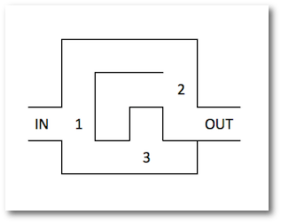
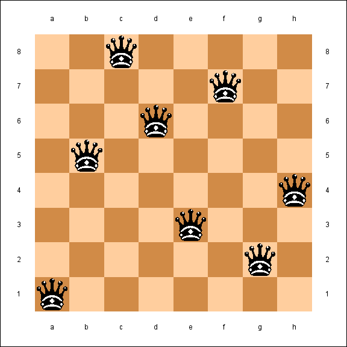
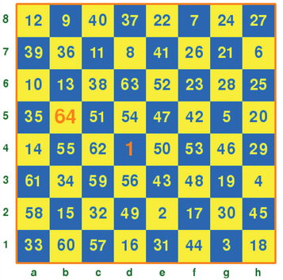

# Bài toán liệt kê: Phương Pháp Sinh và thuật toán Quay Lui (Backtracking)
Phương pháp liệt kê là phương pháp giải quyết bài toán hết sức tự nhiên mà chúng ta thường dùng khi giải toán từ những năm học tiểu học. Tuy nhiên phương pháp này hạn chế ở chỗ số lượng các trường hợp cần liệt kê và thử nghiệm thường rất lớn nên chỉ phù hợp với các bài toán với số liệu nhỏ của các lớp cấp 1.

Tuy nhiên, với sự phát triển nhanh chóng của phần cứng, các máy tính điện tử hiện đại ngày nay có thể thực hiện hàng tỉ phép tính mỗi giây, dẫn đến phạm vị các bài toán có thể giải được bằng phương pháp liệt kê được mở rộng nhanh chóng. Bài viết này giới thiệu một số kiến thức và ví dụ cơ bản về bài toán liệt kê và giới thiệu một phương pháp sử dụng kỹ thuật đệ quy để giải quyết hầu hết các bài toán liệt kê — *phương pháp quay lui* (**Back Tracking**).

## Bài toán liệt kê trong tin học
Trong lập trình, một lớp bài toán rất phổ biến là bài toán liệt kê tất cả các cấu hình của một loại tổ hợp nào đó. Ví dụ: liệt kê các tập hợp con của một tập hợp, liệt kê tất cả các cách xếp hàng, liệt kê các hoán vị của một xâu để tìm hoán vị phù hợp…

Các bài toán liệt kê có thể được giải bằng phương pháp sinh lần lượt tất cả các cấu hình như vậy. Để làm được điều này, bài toán cần thỏa mãn hai điều kiện sau:

* Có thể xác định được một **thứ tự** trên tập các cấu hình tổ hợp cần liệt kê (**thứ tự từ điển**). Từ đó có thể biết được cấu hình đầu tiên và cấu hình cuối cùng trong thứ tự đó.
* Xây dựng được thuật toán từ một cấu hình chưa phải cấu hình cuối, sinh ra được **cấu hình kế tiếp** nó.

## Thứ tự từ điển
Trên các kiểu dữ liệu đơn giản như kiểu số, kiểu ký tự..., các giá trị có thể so sánh lớn hơn - nhỏ hơn với nhau, hay nói cách khác, có thể xếp thứ tự các giá trị của cùng một kiểu dữ liệu. Ví dụ trên kiểu số, ta có quan hệ `1 < 2; 3 < 10...`, trên kiểu ký tự thì có `'A' < 'Z', 'B' < 'b'`...

Tương tự, trên tập các cấu hình của cùng một tổ hợp, ta cũng có thể xác định một quan hệ thứ tự. Thứ tự này quyết định cầu hình nào đứng trước, cấu hình nào đứng sau trong một phương pháp liệt kê, được gọi là **thứ tự từ điển**.

Cụ thể, xét hai dãy `a[1..n]` và `b[1..n]` là hai dãy độ dài n, trên các phần tử riêng lẻ của a và b đã có quan hệ thứ tự ≤. Khi đó, ta nói `a ≤ b` nếu:

* Hoặc `a[i] = b[i]` với `∀i: 1 ≤ i ≤ n`, khi đó ta viết `a = b`.
* Hoặc tồn tại một số nguyên dương k: `1 ≤ k < n` để:<br/>
a[1] = b[1]<br/>
a[2] = b[2]<br/>
...<br/>
a[k] = b[k]<br/>
a[k+1] < b[k+1]<br/>
Trong trường hợp này, ta có a < b.<br/>

Trong trường hợp độ dài hai dãy không bằng nhau, thứ tự từ điển vẫn có thể được xác định bằng cách thêm các phần tử rỗng (phần tử ∅) vào cuối dãy ngắn hơn để được hai dãy có độ đài bằng nhau. Khi đó hai dãy được so sánh bình thường như cách ở trên, với lưu ý là phần tử rỗng nhỏ hơn tất cả các phần tử khác. Cách so sánh này cũng chính là cách so sánh các xâu ký tự trong các ngôn ngữ lập trình.

Ví dụ:

* {1, 2, 3, 4} < {5, 6}
* {a, b, c} < {a, b, c, d}
* ‘calculator’ < ‘computer’

## Phương pháp sinh
Bài toán liệt kê tất cả các cấu hình của một tổ hợp có thể được giải quyết bằng phương pháp sinh, với thuật toán tổng quát như sau:

1. Xây dựng cấu hình đầu tiên (có thứ tự từ điển nhỏ nhất)
1. Đưa ra (in ra, lưu lại...) cấu hình hiện tại
1. Kiểm tra cấu hình hiện tại có phải là cầu hình cuối cùng không, nếu đúng thì chuyển qua bước 6.
1. Từ cấu hình hiện tại, sinh ra cấu hình kế tiếp (cấu hình nhỏ nhất có thứ tự từ điển lớn hơn cấu hình hiện tại)
1. Quay lại bước 2
1. Kết thúc

Thuật toán trên có thể viết dưới dạng giả code như sau:

```
<Xây dựng cấu hình đầu tiên>
while True:
    <In ra cấu hình đang có>
    if <đây là cấu hình cuối cùng>:
        break
    <sinh cấu hình tiếp theo>
```

Trong các bước của thuật toán sinh mô tả ở trên, bước 4 là bước khó nhất của bài toán. Làm thế nào để từ một cấu hình hiện tại sinh ra được cấu hình tiếp theo? Việc này phụ thuộc hoàn toàn vào đặc thù của từng bài toán, từng loại tổ hợp

Bài toán liệt kê có liên quan mật thiết với Đại số tổ hợp. Các bạn có thể đọc thêm 
<a href='https://medium.com/@thucnc/t%C3%B3m-l%C6%B0%E1%BB%A3c-m%E1%BB%99t-s%E1%BB%91-ki%E1%BA%BFn-th%E1%BB%A9c-v%E1%BB%81-%C4%91%E1%BA%A1i-s%E1%BB%91-t%E1%BB%95-h%E1%BB%A3p-%E1%BB%A9ng-d%E1%BB%A5ng-trong-tin-h%E1%BB%8Dc-4cbb58b90162'>tại đây</a>

Sau đây là một số ví dụ bài toán sử dụng phương pháp sinh.
### Bài toán 1. Sinh dãy nhị phân độ dài n
Ví dụ với n = 3, các dãy nhị phân cần sinh ra sẽ là:

```
000
001
010
011
100
101
110
111
```
### Bài toán 2. Sinh tất cả các hoán vị của n phần tử
Cho số nguyên dương n. Hãy sinh tất cả các hoán vị của tập {1, 2, 3, ..., n} theo thứ tự từ điển.

Ví dụ với n = 3, các hoán vị cần sinh ra sẽ là:

```
1 2 3
1 3 2
2 1 3
2 3 1
3 1 2
3 2 1
```
### Bài toán 3. Phân tích số
Liệt kê tất cả các cách phân tích số nguyên dương n thành tổng các số nguyên dương, hai cách phân tích là hoán vị của nhau chỉ tính là một cách.

Ví dụ với n = 5, các cách phân tích cần liệt kê sẽ là:

```
1 1 1 1 1
1 1 1 2
1 1 3
1 2 2
1 4
2 3
5
```

## Thuật toán Quay Lui (Backtracking)
**Quay Lui** là một chiến thuật sử dụng đệ quy để giải các bài toán liệt kê các cấu hình. Ý tưởng của thuật toán quay lui hết sức tự nhiên, giống như việc giải toán bằng cách liệt kê mà chúng ta vẫn sử dụng ở khối tiểu học. Một cấu hình được xây dựng bằng nhiều phần tử, mỗi phần tử được chọn bằng cách thử lần lượt tất cả các khả năng có thể của nó. Với mỗi khả năng của phần tử hiện tại, ta lại thử tất cả các khả năng của phần tử tiếp theo, sau đó quay ngược lại khả năng tiếp theo của phần tử trước, rồi lại thử tất cả các khả năng của phần tử tiếp theo... cứ như thế đến khi nào thử hết tất cả các bộ cấu hình có thể có.

Người đầu tiên đề ra thuật ngữ này (backtrack) là nhà toán học người Mỹ D. H. Lehmer vào những năm 1950.

Giả sử cấu hình cần liệt kê có dạng x[1..n], khi đó thuật toán quay lui thực hiện qua các bước:

* 1.Xét tất cả các giá trị x₁ có thể nhận, thử cho x₁ nhận lần lượt các giá trị đó. Với mỗi giá trị thử gán cho x₁ ta sẽ:
* 2.Xét tất cả các giá trị x₂ có thể nhận, lại thử cho x₂ nhận lần lượt các giá trị đó. Với mỗi giá trị thử gán cho x₂ lại xét tiếp các khả năng chọn x₃ … cứ tiếp tục như vậy đến bước:
* …
* n. Xét tất cả các giá trị xₙ có thể nhận, thử cho xₙ nhận lần lượt các giá trị đó, thông báo cấu hình tìm được {x₁, x₂, …, xₙ}.

Có thể nhìn thấy ngay, mô hình như trên có thể cài đặt bằng các vòng lặp lồng nhau quen thuộc:

```
for x₁ in〈các giá trị có thể của x₁〉:
    for x₂ in〈các giá trị có thể của x₂〉:
        ...
            for xₙ in〈các giá trị có thể của xₙ〉:
                {in ra cấu hình x₁, x₂, ..., xₙ}
```

Tuy nhiên, trong hầu hết các trường hợp, n khá lớn và không cố định, vì vậy hầu như không thể sử dụng các vòng lặp lồng nhau để cài đặt bài toán này. Thay vào đó, ta sử dụng kỹ thuật Đệ Quy với tư tưởng như sau:

Để liệt kê các cấu hình n phần tử dạng x[1..n], ta thử cho x₁ nhận lần lượt các giá trị có thể. Với mỗi giá trị thử gán cho x₁ bài toán trở thành liệt kê tiếp cấu hình n -1 phần tử x[2..n]. Như vậy bài toán được thu nhỏ lại với n-1 phần tử, sau đó n-2 phần tử... cho đến phần tử thứ n. Đây chính là mô hình Đệ Quy. Giải thuật này được cài đặt như sau:

```
1  attempt(i):
2     for v in〈các giá trị có thể của xᵢ〉:
3         gán xᵢ= v
4         if 〈xᵢ là phần tử cuối cùng trong cấu hình〉:
5             {xuất ra cấu hình tìm được}
6         else:
7             {đánh dấu đã gán v cho xᵢ (nếu cần)}
8             attempt(i+1)
9             {bỏ đánh dấu đã gán v cho xᵢ (nếu cần)}
```

Để minh họa cho thuật toán này, ta xét ví dụ sau: giả sử ta cần tìm đường ra khỏi mê cung, với nhiều ngã rẽ khác nhau, một trong các phương pháp chắc chắn tìm được lời giải (có thể lâu) là thử từng ngã rẽ một cho đến khi tìm được đường ra. Giả sử ta có mê cung với 3 ngã rẽ như sau:



_Mê cung với 3 đoạn rẽ được đánh số 1, 2, 3_

Cây đệ quy tìm kiếm sử dụng thuật toán Quay Lui sẽ như sau:


Cụ thể, chương trình sẽ chạy qua các bước như sau:

```
- Tại ngã rẽ 1, chọn đi xuống      
    - Tại ngã rẽ 3 chọn đi thẳng  
         đường cụt --> bỏ          
    - Tại ngã rẽ 3 chọn sang trái 
         đường cụt --> bỏ          
- Tại ngã rẽ 1, chọn đi lên      
    - Tại ngã rẽ 2 chọn sang trái 
         tìm thấy đường thoát      (in ra tìm thấy đường đi)
    - Tại ngã rẽ 2 chọn sang phải 
         đường cụt --> bỏ          
```

Ở đây, các hướng đi có thể tại ngã rẽ 1 là [đi xuống, đi lên], ở ngã rẽ 2 là 

```
[sang trái, sang phải], ở ngã rẽ 3 là [đi thẳng, sang trái].
```

Sau đây là một số ví dụ bài toán sử dụng thuật toán Quay Lui. Mã nguồn được viết bằng ngôn ngữ Python 3, bạn đọc có thể dễ dàng chuyển qua các ngôn ngữ khác.

### Bài toán 1. Sinh dãy nhị phân độ dài n
(Đề bài đã được phát biểu ở phía trên, trong phần Phương pháp sinh)

Chương trình sử dụng thuật toán Quay Lui (Python) như sau:

```
n = int(input())
a = [0] * n
def attempt(i):
  for v in [0,1]:
    a[i] = v
    if i>=n-1:
      print(*a)
    else:
      attempt(i+1)
attempt(0)
```

Khi chạy chương trình và nhập vào giá trị 3 cho n, ta được kết quả như sau:

```
0 0 0
0 0 1
0 1 0
0 1 1
1 0 0
1 0 1
1 1 0
1 1 1
```

>Nhận xét: trong bài toán sinh dãy nhị phân, mỗi phần tử đều có thể nhận một trong hai giá trị [0, 1] và các giá trị này có thể lặp lại, vì vậy ta không cần bước đánh dấu các giá trị đã dùng bởi các phần tử trước khi gọi đệ quy đến phần tử tiếp theo.

### Bài toán 2. Sinh tất cả các hoán vị của n phần tử
(Đề bài đã được phát biểu ở phía trên, trong phần Phương pháp sinh)
### Bài toán 3. Phân tích số
(Đề bài đã được phát biểu ở phía trên, trong phần Phương pháp sinh)
### Bài toán 4. Xếp hậu
Liệt kê tất cả các cách xếp 8 quân hậu trên bàn cờ vua (8×8) sao cho không có cặp hậu nào ăn được nhau.

Ví dụ một cách xếp thỏa mãn đề bài:



Giải bài toán tổng quát với bàn cờ kích thước n × n (n quân hậu).
### Bài toán 5. Mã đi tuần
Cho một quân mã đứng tại một vị trí cho trước trên bàn cờ vua, hãy tìm một hành trình cho quân mã xuất phát từ vị trí ban đầu, đi qua tất cả các ô của bàn cờ, mỗi ô đúng một lần.

Ví dụ một hành trình như vậy:



Giải bài toán tổng quát với bàn cờ kích thước n × m.

### Nhận xét
Thuật toán Quay lui (Backtracking), hay nói chính xác hơn là thuật toán vét cạn bằng quay lui là thuật toán rất tổng quát, áp dụng được với lớp rất rộng các bài toán tìm kiếm, tối ưu và lại rất dễ cài đặt (xem giả code ở trên). Vì vậy đây là thuật toán hết sức quan trọng cần phải nắm vững.

Nhược điểm của thuật toán quay lui và các thuật toán vét cạn nói chung chính là sự bùng nổ tổ hợp: khi kích thước của cấu hình tăng lên, số lượng các khả năng cần duyệt tăng lên rất nhanh (theo hàm mũ), đồng nghĩa với việc cây đệ quy lớn lớn lên rất nhanh và sẽ nhanh trong vượt quá khả năng xử lý của máy tính trong thời gian cho phép.

Có rất nhiều kỹ thuật đã được nêu ra nhằm giải quyết vấn đề này, kỹ thuật phổ biến và tự nhiên nhất là loại bỏ sớm những phương án chắc chắn không đưa ra kết quả. Có thể hình dung việc này giống như việc chặt bớt các nhánh trên cây, càng phát hiện sớm các phương án không ra kết quả (càng chặt các nhánh cây gần gốc) thì không gian tìm kiếm càng nhỏ đi (số lượng các trường hợp cần duyệt càng giảm nhanh). Kỹ thuật này gọi là kỹ thuật nhánh cận (Branch and Bound) mà chúng ta sẽ cùng tìm hiểu trong một bài viết khác.

@see [https://medium.com/@thucnc/b%C3%A0i-to%C3%A1n-li%E1%BB%87t-k%C3%AA-ph%C6%B0%C6%A1ng-ph%C3%A1p-sinh-v%C3%A0-thu%E1%BA%ADt-to%C3%A1n-quay-lui-backtracking-10f216fee9e](https://medium.com/@thucnc/b%C3%A0i-to%C3%A1n-li%E1%BB%87t-k%C3%AA-ph%C6%B0%C6%A1ng-ph%C3%A1p-sinh-v%C3%A0-thu%E1%BA%ADt-to%C3%A1n-quay-lui-backtracking-10f216fee9e)

