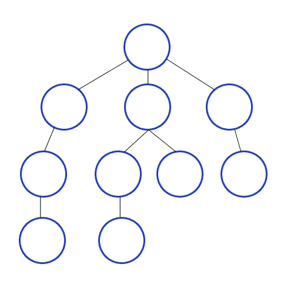
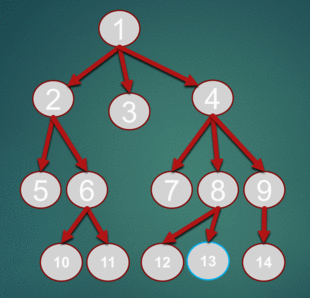

# Thuật toán tìm kiếm theo chiều sâu DFS pascal c++
>Thuật toán tìm kiếm theo chiều sâu DFS là thuật toán tìm kiếm trên cây hoặc đồ thị. Thuật toán này khác với BFS ở chỗ BFS duyệt theo chiều rộng (những đỉnh gần đỉnh gốc sẽ được thăm trước), còn DFS duyệt theo chiều sâu (Xuất phát từ đỉnh gốc, từ đỉnh đó phát triển xa nhất có thể theo mỗi nhánh)

## 1. Ý tưởng và cài đặt thuật toán DFS

**Tư tưởng thuật toán có thể trình bày như sau**: Từ một đỉnh `S` ban đầu ta sẽ có các đỉnh kề là `x`, từ đỉnh `x`ta sẽ có các đỉnh kề là `y`, và nó cũng thuộc nhánh `s-x-y…` Chúng ta thăm các nhánh đó theo chiều sâu (thăm đến khi không còn đỉnh kề chưa duyệt). Điều đó gợi cho chúng ta viết một thủ tục đệ quy `DFS(u)` để mô tả việc duyệt từ đỉnh `u` sang đỉnh kề `v`chưa được thăm.



### a. Mô hình giải thuật DFS

Giải thuật DFS có thể viết theo mô hình dưới đây:

```C++
void dfs(int u)
{
    free[u]=false; // đánh dấu đỉnh u đã được thăm
    for (int v=1; v<=n; v++)
        if ((tồn tại cạnh u, v) và (free[u][v]==true)) // tồn tại đỉnh kề với u, chưa được thăm
            dfs(v); //duyệt đỉnh v
}
```

### b. Đề bài ví dụ

Ví dụ: Viết chương trình ghi ra thứ tự duyệt DFS xuất phát từ đỉnh s. Đồ thi gồm n đỉnh, m cạnh 2 chiều, các thành phần trên đồ thị liên thông với nhau.

Dữ liệu vào:

```
    Dòng đầu: gồm 3 số nguyên n, m, s (1<=n, m<=100, 1<=s<=n)
    M dòng tiếp theo: mỗi dòng gồm 2 số u, v, mô tả 1 cạnh trong đồ thị
```

Dữ liệu ra:

```
    Gồm nhiều dòng, là thứ tự duyệt DFS
```

### c. Code thuật toán DFS
**1. Code DFS C++ tổ chức ma trận kề**

Tham khảo thêm về ma trận kề: https://kienthuc24h.com/ma-tran-ke-cpascal-ly-thuyet-thi/

```C+
#include <bits/stdc++.h>
using namespace std;
 
int a[101][101]; 
 
int n, m, Free[101], u, v, s;
 
void DFS(int u)
{
    cout << u << endl;
    Free[u] = false;
    for (int v = 1; v <= n; v++)
        if (a[u][v] == 1 && Free[v])
            DFS(v);
}
 
int main()
{
    cin >> n >> m >> s;
    for (int i = 1; i <= n; i++)
        for (int j = 1; j <= n; j++)
            a[i][j] = 0;
 
    for (int i = 1; i <= m; i++)
    {
        cin >> u >> v;
        a[u][v] = 1;
        a[v][u] = 1;
    }
 
    for (int i = 1; i <= n; i++)
        Free[i] = 1;
    DFS(s);
    return 0;
}
```

**2. Code DFS Pascal tổ chức ma trận kề**

```C++
Const    maxn = 101; 
Var    a : array [1..maxn,1..maxn] of boolean;
    free : array [1..maxn] of boolean;
    Q : array [1..maxn] of integer;
    n, m, s: integer;
    dau, cuoi : integer;
                
Procedure    init;
Begin
    fillchar(a,sizeof(a),false);
    fillchar(Free,sizeof(Free),true);
end;
 
Procedure    readf;
Var        i, u, v : integer; 
Begin 
    readln(n,m,s);
    for i := 1 to m do
        begin
            readln(u,v);
            A[u,v] := true;
            A[v,u] := true;
        end;
end;
  
  
 
Procedure    DFS(u : integer);
Var     v : integer;
Begin
 writeln(u);
    Free[u] := false;
    
   For v := 1 to n do
 If A[u,v] and Free[v] then
 dfs(v);
end;
 
Procedure    main;
Var        i : integer;
Begin
    init;
    readf;
    DFS(s); 
end;
 
BEGIN
    main;
END.
```

**d. Test ví dụ**

Các bạn có thể thử các bộ test sau:

Test 1:


Input|	Output
|----|----|
|7 7 11 2|1
1 3|2
1 5|4
2 4|6
2 6|5
3 7|3
5 6|7
	

Test 2:

Input|	Output
|----|----|
7 7 41 2|4
1 3|2
1 5|1
2 4|3
2 6|7
3 7|5
5 6|6
	
### 2. Độ phức tạp DFS

**Độ phức tạp thời gian**: O(|V|+|E|) với |V| là số đỉnh của đồ thị, |E| là số cạnh

### 3. Bài tập ứng dụng thuật toán DFS

Bạn có thể áp dụng ngay để làm các bài tập sau về DFS:

Yêu cầu hiểu về thành phần liên thông

1. VBGRASS spoj – Bãi cỏ ngon nhất
2. BCLKCOUN spoj PTIT – Đếm số ao
3. MTNTRAI spoj THPTCBT – 21697. Nông Trại
4. BCISLAND PTIT spoj – Nước biển
5. ADS spoj – Quảng cáo
6. Yêu cầu có kiến thức về cầu – khớp
7. BCACM11E spoj PTIT – Phương án bắn pháo

# Thuật toán tìm kiếm theo chiều rộng BFS pascal c++
>Thuật toán tìm kiếm theo chiều rộng BFS là thuật toán tìm kiếm trong đồ thị bằng cách tìm kiếm dựa trên 2 thao tác chính là: cho trước một đỉnh của đồ thị và thêm các đỉnh kề với nó vào danh sách chờ duyệt. Phương pháp cài đặt này là “lập lịch” để duyệt các đỉnh theo thứ tự duyệt ưu tiên trên chiều rộng (đỉnh nào gần với đỉnh gốc sẽ được duyệt trước)

Vì nguyên tắc trên (đỉnh nào gần gốc sẽ được duyệt trước) nên thuật toán tìm kiếm theo chiều rộng BFS thường được dùng để tìm đường đi ngắn nhất giữa các đỉnh.

Chúng ta sẽ xây dựng một danh sách chứa các đỉnh đang chờ duyệt, tại mỗi bước chúng ta thăm đỉnh ở đầu danh sách và thêm những đỉnh kề với nó chưa có trong danh sách chờ vào cuối danh sách.

Vì nguyên tắc đó nên chúng ta có thể tổ chức danh sách chờ đó bằng cấu trúc dữ liệu hàng đợi (Queue).



Quy ước như sau:

*     Push(x) là đẩy đỉnh x vào queue chờ
*     Pop() lấy một đỉnh từ hàng đợi
*     Empty() xác định queue còn đỉnh nào hay không?

Chúng ta xây dựng bool Free[u] với ý nghĩa đỉnh u trong đồ thị chưa được duyệt đúng không?

– N là số đỉnh của đồ thị

## 1. Mô hình giải thuật BFS

Giải thuật BFS có thể viết theo mô hình dưới đây:

```pascal
Free[u]=true; //với mọi u=1...n
Queue ban đầu rỗng.
Push(s); // Đẩy đỉnh đầu tiên vào queue
Free[s]=false; // đánh dấu đỉnh s
while (not empty())
{
    u = pop(); // lấy từ queue đỉnh u
    for (v=1; v<=n; v++)
        if ((tồn tại cạnh u,v) và Free[v]==true)
        {
            Free[v]=false; // đánh dấu đỉnh v
            Push(v); // đẩy đỉnh v vào queue
        }
}
```

Ví dụ: Viết chương trình ghi ra thứ tự duyệt BFS xuất phát từ đỉnh s. Đồ thi gồm n đỉnh, m cạnh 2 chiều, các thành phần trên đồ thị liên thông với nhau.

Dữ liệu vào:

*     Dòng đầu: gồm 3 số nguyên n, m, s (1<=n, m<=100, 1<=s<=n)
*     M dòng tiếp theo: mỗi dòng gồm 2 số u, v, mô tả 1 cạnh trong đồ thị

Dữ liệu ra:

*     Gồm nhiều dòng, là thứ tự duyệt BFS

## 2. Code thuật toán tìm kiếm theo chiều rộng BFS

Tham khảo thêm về ma trận kề: https://kienthuc24h.com/ma-tran-ke-cpascal-ly-thuyet-thi/

### a. Code thuật toán BFS C++

```C++
#include <bits/stdc++.h>
using namespace std;
 
int a[101][101];
queue <int> q;
 
int n,m,Free[101], u,v,s;
 
void BFS(int s)
{
     q.push(s);
     Free[s]=0;
     while (!q.empty())
     {
        int u = q.front();
        q.pop();
 
        cout << u << endl;
 
        for (int v=1; v<=n; v++)
            if (Free[v] && a[u][v]==1)
            {
                Free[v] = 0;
                q.push(v);
            }
     }
}
 
int main()
{
 cin >> n >> m>> s;
 for (int i=1; i<=n; i++)
        for (int j=1; j<=n; j++)
            a[i][j]=0;
 
 for (int i=1; i<=m; i++)
    {
        cin >> u>> v;
        a[u][v]=1;
        a[v][u]=1;
    }
 
    for (int i=1; i<=n; i++)
        Free[i]=1;
 
    BFS(s);
 
 return 0;
}
```

### b. Code thuật toán tìm kiếm theo chiều rộng bfs trong pascal

```pascal
Const    maxn = 101; 
Var    a : array [1..maxn,1..maxn] of boolean;
    free : array [1..maxn] of boolean;
    Q : array [1..maxn] of integer;
    n, m, s: integer;
    dau, cuoi : integer;
                
Procedure    init;
Begin
    fillchar(a,sizeof(a),false);
    fillchar(Free,sizeof(Free),true);
    dau:=1; cuoi:=0;
end;
 
Procedure    readf;
Var        i, u, v : integer; 
Begin 
    readln(n,m,s);
    for i := 1 to m do
        begin
            readln(u,v);
            A[u,v] := true;
            A[v,u] := true;
        end;
end;
  
 
Procedure    Push(u:integer);
begin
    inc(cuoi);
    Q[cuoi] := u;
end;
 
Function    Pop : integer;
Begin 
    Pop := Q[dau];
    inc(dau);
end;
 
Procedure    BFS(i : integer);
Var     u, v : integer;
Begin
    Push(i); 
    Free[i] := false;
 
    While dau<=cuoi do
        begin
            u := Pop;
            writeln(u);
            For v := 1 to n do
                If A[u,v] and Free[v] then
                    begin
                        Push(v);
                        Free[v] := false;
                    end;
        end;
end;
 
Procedure    main;
Var        i : integer;
Begin
    init;
    readf;
    BFS(s); 
end;
 
BEGIN
    main;
END.
```

## 3. Độ phức tạp thuật toán BFS

Độ phức tạp thời gian: O(|V|+|E|) với |V| là số đỉnh của đồ thị, |E| là số cạnh

Độ phức tạp dữ liệu: O(|V|)
## 4. Bài tập ứng dụng thuật toán BFS

Bạn có thể áp dụng ngay để làm các bài tập sau về BFS:

* https://kienthuc24h.com/wecode-2015-problem-h-tim-duong-di-ngan-nhat/
* https://kienthuc24h.com/upcoder-bfs-r2-b3-hereditament-hereditament/

Bài này yêu cầu bạn phải có kiến thức về thành phần liên thông:

* https://kienthuc24h.com/bclkcoun-spoj-ptit-dem-so-ao/
* https://kienthuc24h.com/bcdaisy-spoj-ptit-chu-bo-hu-hong/
* https://kienthuc24h.com/bfs-spoj-ppath/

