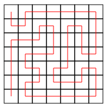

# Grid Paths

There are 88418 paths in a 7×7 grid from the upper-left square to the lower-left square. Each path corresponds to a 48-character description consisting of characters D (down), U (up), L (left) and R (right).

For example, the path



corresponds to the description 

```
DRURRRRRDDDLUULDDDLDRRURDDLLLLLURULURRUULDLLDDDD.
```

You are given a description of a path which may also contain characters ? (any direction). Your task is to calculate the number of paths that match the description.

## Input

The only input line has a 48-character string of characters ?, D, U, L and R.

## Output

Print one integer: the total number of paths.


## Example

Input:

```
??????R??????U??????????????????????????LD????D?
```

Output:
201


